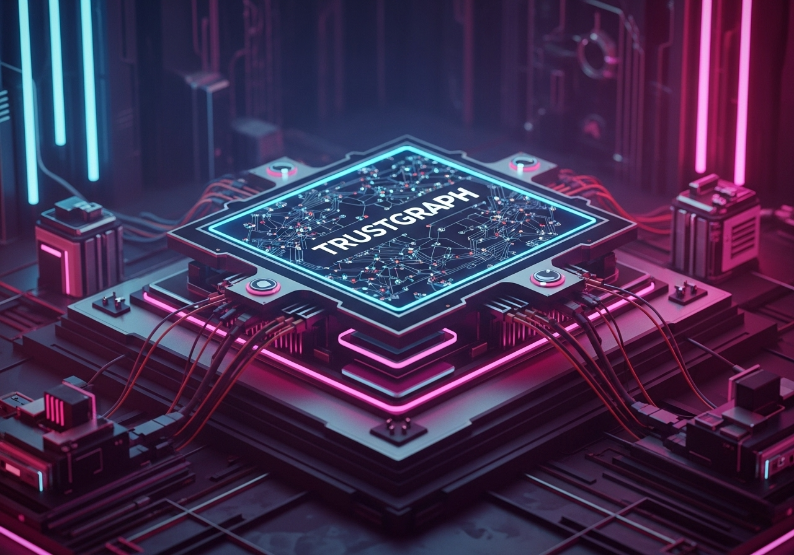
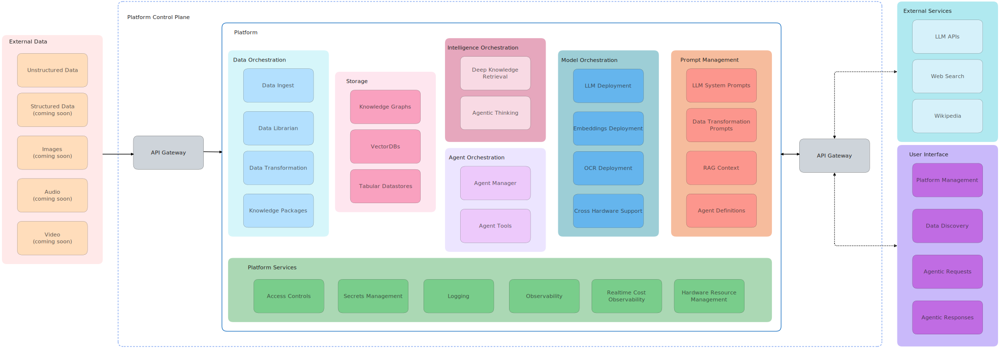

<div align="center">

## The Sovereign Universal AI Adapter

[](https://pypi.org/project/trustgraph/) [](https://discord.gg/sQMwkRz5GX)

[Full Docs](https://docs.trustgraph.ai/docs/TrustGraph) | [YouTube](https://www.youtube.com/@TrustGraphAI?sub_confirmation=1) | [Configuration Builder](https://config-ui.demo.trustgraph.ai/) | [API Docs](docs/apis/README.md) | [CLI Docs](docs/cli/README.md) | [Discord](https://discord.gg/sQMwkRz5GX) | [Blog](https://blog.trustgraph.ai/subscribe)

</div>

Take control of your data and AI future with **TrustGraph**. Universal connectors can call the latest LLMs or deploy models on your hardware. **TrustGraph** future-proofs your AI strategy with graph driven intelligence that can deploy in any environment.

---

<details>
<summary>Table of Contents</summary>
<br>

- [**Why TrustGraph?**](#why-trustgraph)<br>
- [**Getting Started**](#getting-started)<br>
- [**Configuration Builder**](#configuration-builder)<br>
- [**GraphRAG**](#graphrag)<br>
- [**Knowledge Packages**](#knowledge-packages)<br>
- [**Architecture**](#architecture)<br>
- [**Integrations**](#integrations)<br>
- [**Observability & Telemetry**](#observability--telemetry)<br>
- [**Contributing**](#contributing)<br>
- [**License**](#license)<br>
- [**Support & Community**](#support--community)<br>

</details>

---

## Why TrustGraph?

If you want to build powerful, intelligent AI applications without getting bogged down by complex infrastructure, brittle data pipelines, or opaque "black box" systems, TrustGraph is the platform that accelerates your AI transformation by solving these core problems.

- **Go Beyond Basic RAG with GraphRAG**: Stop building agents that just retrieve text snippets. TrustGraph provides the tooling to automatically build and query Knowledge Graphs combined with Vector Embeddings, enabling you to create applications with deep contextual reasoning and higher accuracy.
- **Decouple Your App from the AI Stack**: Our modular, containerized architecture lets you deploy anywhere (Docker, K8s, bare-metal) and swap out components (LLMs, vector DBs, graph DBs) without re-architecting your core application. Write your app once, knowing the underlying AI stack can evolve.
- **Automate the Knowledge Pipeline**: Focus on building your application's logic, not on writing ETL scripts for AI. TrustGraph provides a unified platform to ingest data from silos, transform it into structured Knowledge Packages, and deliver it to your AI – streamlining the entire "knowledge supply chain."
- **Enjoy Full Transparency & Control**: As an open-source platform, you get complete visibility into the system's inner workings. Debug more effectively, customize components to your needs, and maintain total control over your application's data flow and security, eliminating vendor lock-in.

## Getting Started

This is a very-quickstart.  See [other installation options](docs/README.md#ways-to-deploy).

- [Quickstart Guide](docs/README.quickstart-docker-compose.md)
- [Configuration Builder](#configuration-builder)
- [Install the CLI](docs/cli/README.md)
- [Workbench](#workbench)
- [Developer APIs](docs/apis#readme)

### Cloud Deployment Options

- [AWS EC2 single instance deployment using Pulumi](https://github.com/trustgraph-ai/pulumi-trustgraph-ec2)
- [AWS deployment with RKE Kubernetes using Pulumi](https://github.com/trustgraph-ai/pulumi-trustgraph-aws-rke)
- [Azure Kubernetes deployment using Pulumi](https://github.com/trustgraph-ai/pulumi-trustgraph-aks)
- [GCP GKE cloud deployment using Pulumi](https://github.com/trustgraph-ai/pulumi-trustgraph-gke)
- [Intel Gaudi and GPU (tested on Intel Tiber cloud)](https://github.com/trustgraph-ai/trustgraph-tiber-cloud)
- [Scaleway Kubernetes deployment using Pulumi](https://github.com/trustgraph-ai/pulumi-trustgraph-scaleway)

## Configuration Builder

The [**Configuration Builder**](https://config-ui.demo.trustgraph.ai/) assembles all of the selected components and builds them into a deployable package. It has 4 sections:

- **Version**: Select the version of TrustGraph you'd like to deploy
- **Component Selection**: Choose from the available deployment platforms, LLMs, graph store, VectorDB, chunking algorithm, chunking parameters, and LLM parameters
- **Customization**: Customize the prompts for the LLM System, Data Extraction Agents, and Agent Flow
- **Finish Deployment**: Download the launch `YAML` files with deployment instructions

### Workbench

If added to the build in the **Configuration Builder**, the **Test Suite** will be available at port `8888`. The **Test Suite** has the following capabilities:

- **GraphRAG Chat**: GraphRAG queries in a chat interface
- **Vector Search**: Semantic similarity search with cosine similarity scores
- **Semantic Relationships**: See semantic relationships in a list structure
- **Graph Visualizer**: Visualize semantic relationships in **3D**
- **Data Loader**: Directly load `.pdf`, `.txt`, or `.md` into the system with document metadata

## GraphRAG

TrustGraph features an advanced GraphRAG approach that automatically constructs Knowledge Graphs with mapped Vector Embeddings to provide richer and more accurate context to LLMs for trustworthy agents.

**How TrustGraph's GraphRAG Works:**

- **Automated Knowledge Graph Construction:** Data Transformation Agents processes source data to automatically **extract key entities, topics, and the relationships** connecting them. Vector emebeddings are then mapped to these semantic relationships for context retrieval.
- **Hybrid Retrieval:** When an agent needs to perform deep research, it first performs a **cosine similarity search** on the vector embeddings to identify potentially relevant concepts and relationships within the knowledge graph. This initial vector search **pinpoints relevant entry points** within the structured Knowledge Graph.
- **Context Generation via Subgraph Traversal:** Based on the ranked results from the similarity search, agents are provided with only the relevant subgraphs for **deep context**. Users can configure the **number of 'hops'** (relationship traversals) to extend the depth of knowledge availabe to the agents. This structured **subgraph**, containing entities and their relationships, forms a highly relevant and context-aware input prompt for the LLM that is endlessly configurable with options for the number of entities, relationships, and overall subgraph size.

## Knowledge Packages

One of the biggest challenges currently facing RAG architectures is the ability to quickly reuse and integrate knowledge sets. **TrustGraph** solves this problem by storing the results of the data ingestion process in reusable Knowledge Packages. Being able to store and reuse the Knowledge Packages means the data transformation process has to be run only once. These reusable Knowledge Packages can be loaded back into **TrustGraph** and used for GraphRAG.

A Knowledge Package has two components:

- Set of Graph Edges
- Set of mapped Vector Embeddings

When a Knowledge Package is loaded into TrustGraph, the corresponding graph edges and vector embeddings are queued and loaded into the chosen graph and vector stores.

## Architecture

The platform contains the services, stores, control plane, and API gateway needed to connect your data to intelligent agents.



The platform orchestrates a comprehensive suite of services to transform external data into intelligent, actionable outputs for AI agents and users. It interacts with external data sources and external services (like LLM APIs) via an **API Gateway**.

Within the **TrustGraph** Platform, the services are grouped as follows:

- **Data Orchestration:** This crucial set of services manages the entire lifecycle of ingesting and preparing data to become AI-ready knowledge. It includes **Data Ingest** capabilities for various data types, a *Data Librarian* for managing and cataloging this information, *Data Transformation* services to clean, structure, and refine raw data, and ultimately produces consumable *Knowledge Packages* – the structured, enriched knowledge artifacts for AI.
- **Data Storage:** The platform relies on a flexible storage layer designed to handle the diverse needs of AI applications. This includes dedicated storage for *Knowledge Graphs* (to represent interconnected relationships), *VectorDBs* (for efficient semantic similarity search on embeddings), and *Tabular Datastores* (for structured data).
- **Intelligence Orchestration:** This is the core reasoning engine of the platform. It leverages the structured knowledge from the Storage layer to perform *Deep Knowledge Retrieval* (advanced search and context discovery beyond simple keyword matching) and facilitate *Agentic Thinking*, enabling AI agents to process information and form complex responses or action plans.
- **Agent Orchestration:** This group of services is dedicated to managing and empowering the AI agents themselves. The *Agent Manager* handles the lifecycle, configuration, and operation of agents, while *Agent Tools* provide a framework or library of capabilities that agents can utilize to perform actions or interact with other systems.
- **Model Orchestration:** This layer is responsible for the deployment, management, and operationalization of the various AI models TrustGraph uses or provides to agents. This includes *LLM Deployment*, *Embeddings Deployment*, and *OCR Deployment*. Crucially, it features *Cross Hardware Support*, indicating the platform's ability to run these models across diverse computing environments.
- **Prompt Management:** Effective interaction with AI, especially LLMs and agents, requires precise instruction. This service centralizes the management of all prompt types: *LLM System Prompts* (to define an LLM's persona or core instructions), *Data Transformation Prompts* (to guide AI in structuring data), **RAG Context** generation (providing relevant intelligence to LLMs), and *Agent Definitions* (the core instructions and goals for AI agents).
- **Platform Services:** These foundational services provide the essential operational backbone for the entire TrustGraph platform, ensuring it runs securely, reliably, and efficiently. This includes *Access Controls* (for security and permissions), *Secrets Management* (for handling sensitive credentials), *Logging* (for audit and diagnostics), *Observability* (for monitoring platform health and performance), *Realtime Cost Observability* (for tracking resource consumption expenses), and *Hardware Resource Management* (for optimizing the use of underlying compute).

## Integrations
TrustGraph provides maximum flexibility so your agents are always powered by the latest and greatest components.

<details>
<summary>LLM APIs</summary>
<br>

- Anthropic<br>
- AWS Bedrock<br>
- AzureAI<br>
- AzureOpenAI<br>
- Cohere<br>
- Google AI Studio<br>
- Google VertexAI<br>
- Mistral<br>
- OpenAI<br>

</details>
<details>
<summary>LLM Orchestration</summary>
<br>

- LM Studio<br>
- Llamafiles<br>
- Ollama<br>
- TGI<br>
- vLLM<br>

</details>
<details>
<summary>VectorDBs</summary>
<br>

- Qdrant (default)<br>
- Pinecone<br>
- Milvus<br>

</details>
<details>
<summary>Graph Storage</summary>
<br>

- Apache Cassandra (default)<br>
- Memgraph<br>
- Neo4j<br>
- FalkorDB<br>

</details>
<details>
<summary>Observability</summary>
<br>  

- Prometheus<br>
- Grafana<br>

</details>
<details>
<summary>Control Plane</summary>
<br>

- Apache Pulsar<br>

</details>
<details>
<summary>Clouds</summary>
<br>

- AWS<br>
- Azure<br>
- Google Cloud<br>
- Intel Tiber Cloud<br>
- Scaleway<br>

</details>

### Pulsar Control Plane

- For flows, Pulsar accepts the output of a processing module and queues it for input to the next subscribed module.
- For services such as LLMs and embeddings, Pulsar provides a client/server model.  A Pulsar queue is used as the input to the service.  When processed, the output is then delivered to a separate queue where a client subscriber can request that output.

PDF file:
```
tg-load-pdf <document.pdf>
```

Text or Markdown file:
```
tg-load-text <document.txt>
```

### GraphRAG Queries

Once the knowledge graph and embeddings have been built or a cognitive core has been loaded, RAG queries are launched with a single line:

```
tg-invoke-graph-rag -q "What are the top 3 takeaways from the document?"
```

### Agent Flow

Invoking the Agent Flow will use a ReAct style approach the combines Graph RAG and text completion requests to think through a problem solution.

```
tg-invoke-agent -v -q "Write a blog post on the top 3 takeaways from the document."
```

> [!TIP]
> Adding `-v` to the agent request will return all of the agent manager's thoughts and observations that led to the final response.

## Observability & Telemetry

Once the platform is running, access the Grafana dashboard at:

```
http://localhost:3000
```

Default credentials are:

```
user: admin
password: admin
```

The default Grafana dashboard tracks the following:

- LLM Latency
- Error Rate
- Service Request Rates
- Queue Backlogs
- Chunking Histogram
- Error Source by Service
- Rate Limit Events
- CPU usage by Service
- Memory usage by Service
- Models Deployed
- Token Throughput (Tokens/second)
- Cost Throughput (Cost/second)

## Contributing

[Developing for TrustGraph](docs/README.development.md)

## License

**TrustGraph** is licensed under [Apache 2.0](https://www.apache.org/licenses/LICENSE-2.0).

   Copyright 2024-2025 TrustGraph

   Licensed under the Apache License, Version 2.0 (the "License");
   you may not use this file except in compliance with the License.
   You may obtain a copy of the License at

       http://www.apache.org/licenses/LICENSE-2.0

   Unless required by applicable law or agreed to in writing, software
   distributed under the License is distributed on an "AS IS" BASIS,
   WITHOUT WARRANTIES OR CONDITIONS OF ANY KIND, either express or implied.
   See the License for the specific language governing permissions and
   limitations under the License.

## Support & Community
- Bug Reports & Feature Requests: [Discord](https://discord.gg/sQMwkRz5GX)
- Discussions & Questions: [Discord](https://discord.gg/sQMwkRz5GX)
- Documentation: [Docs](https://docs.trustgraph.ai/docs/getstarted)
