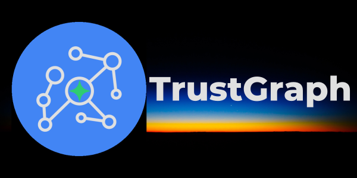
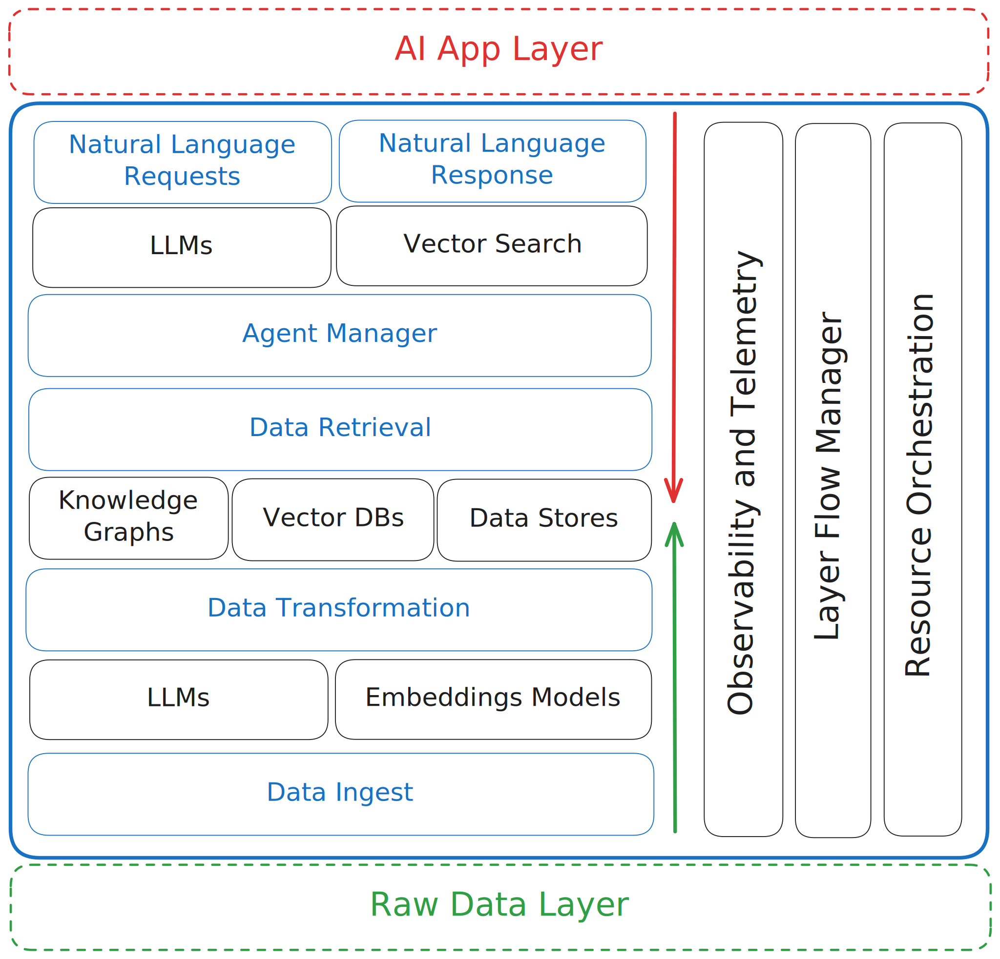

<div align="center">

## Autonomous Operations Platform

[](https://pypi.org/project/trustgraph/) [](https://discord.gg/sQMwkRz5GX)

📑 [Docs](https://trustgraph.ai/docs/getstarted) 📺 [YouTube](https://www.youtube.com/@TrustGraphAI?sub_confirmation=1) 🧠 [Knowledge Cores](https://github.com/trustgraph-ai/catalog/tree/master/v3) ⚙️ [API Docs](docs/apis/README.md) 🧑‍💻 [CLI Docs](https://trustgraph.ai/docs/running/cli) 💬 [Discord](https://discord.gg/sQMwkRz5GX) 📖 [Blog](https://blog.trustgraph.ai/subscribe)

</div>

**Transform AI agents from experimental concepts into a new paradigm of continuous operations.**

The **TrustGraph** platform provides a robust, scalable, and reliable AI infrastructure designed for complex environments, complete with a full observability and telemetrystack. **TrustGraph** automates the deployment in local and cloud environments of state-of-the-art RAG pipelines using Knowledge Graphs and Vector Databases with a unified interface to all major LLM providers.

---

## Table of Contents

-   ✨ [Key Features](#-key-features)
-   🎯 [Why TrustGraph?](#-why-trustgraph)
-   🚀 [Getting Started](#-getting-started)
-   🔧 [Configuration Builder](#-configuration-builder)
-   📐 [Architecture](#-architecture)
-   🧩 [Integrations](#-integrations)
-   📊 [Observability & Telemetry](#-observability--telemetry)
-   🤝 [Contributing](#-contributing)
-   📄 [License](#-license)
-   📞 [Support & Community](#-support--community)

---

## ✨ Key Features

- 📄 **Data Ingest**: Bulk ingest documents such as `.pdf`,`.txt`, and `.md`
- 📃 **OCR Pipelines**: OCR documents with PDF decode, Tesseract, or Mistral OCR services
- 🪓 **Adjustable Chunking**: Choose your chunking algorithm and parameters
- 🔁 **No-code LLM Integration**: **Anthropic**, **AWS Bedrock**, **AzureAI**, **AzureOpenAI**, **Cohere**, **Google AI Studio**, **Google VertexAI**, **Llamafiles**, **LM Studio**, **Mistral**, **Ollama**, and **OpenAI**
- 📖 **Automated Knowledge Graph Building**: No need for complex ontologies and manual graph building
- 🔢 **Knowledge Graph to Vector Embeddings Mappings**: Connect knowledge graph enhanced data directly to vector embeddings
- ❔**Natural Language Data Retrieval**: Automatically perform a semantic similiarity search and subgraph extraction for the context of LLM generative responses
- 🧠 **Knowledge Cores**: Modular data sets with semantic relationships that can saved and quickly loaded on demand
- 🤖 **Agent Manager**: Define custom tools used by a ReAct style Agent Manager that fully controls the response flow including the ability to perform Graph RAG requests
- 📚 **Multiple Knowledge Graph Options**: Full integration with **Memgraph**, **FalkorDB**, **Neo4j**, or **Cassandra**
- 🧮 **Multiple VectorDB Options**: Full integration with **Qdrant**, **Pinecone**, or **Milvus**
- 🎛️ **Production-Grade** Reliability, scalability, and accuracy
- 📊 **Observability and Telemetry**: Get insights into system performance with **Prometheus** and **Grafana**
- 🎻 **Orchestration**: Fully containerized with **Docker** or **Kubernetes**
- 🥞 **Stack Manager**: Control and scale the stack with confidence with **Apache Pulsar**
- ☁️ **Cloud Deployments**: **AWS**, **Azure**, and **Google Cloud**
- 🪴 **Customizable and Extensible**: Tailor for your data and use cases
- 🖥️ **Configuration Builder**: Build the `YAML` configuration with drop down menus and selectable parameters
- 🕵️ **Test Suite**: A simple UI to fully test TrustGraph performance

## 🎯 Why TrustGraph?

Traditional operations often involve manual intervention, siloed tools, and reactive problem-solving. While AI agents show promise, integrating them into reliable, continuous enterprise workflows presents significant challenges:

1.  **Scalability & Reliability:** Standalone agent scripts don't scale or offer the robustness required for business-critical operations.
2.  **Contextual Understanding:** Agents need deep, relevant context (often locked in enterprise data) to perform complex tasks effectively. RAG is powerful but complex to set up and manage.
3.  **Integration Hell:** Connecting agents to diverse enterprise systems, data sources, and various LLMs is difficult and time-consuming.
4.  **Lack of Oversight:** Monitoring, debugging, and understanding the behavior of multiple autonomous agents in production is critical but often overlooked.

**TrustGraph addresses these challenges by providing:**

*   A **platform**, not just a library, for managing the lifecycle of autonomous operations.
*   **Automated, best-practice RAG deployments** that combine the strengths of semantic vector search and structured knowledge graph traversal.
*   A **standardized layer** for LLM interaction and enterprise system integration.
*   **Built-in observability** to ensure you can trust and manage your autonomous systems.

## 🚀 Getting Started
- [Install the CLI](#install-the-trustgraph-cli)
- [Configuration Builder](#-configuration-builder)
- [Platform Restarts](#platform-restarts)
- [Test Suite](#test-suite)
- [Example Notebooks](#example-trustgraph-notebooks)

### Developer APIs and CLI

- [**REST API**](docs/apis/README.md#rest-apis)
- [**Websocket API**](docs/apis/README.md#websocket-api)
- [**Python SDK**](https://trustgraph.ai/docs/api/apistarted)
- [**TrustGraph CLI**](https://trustgraph.ai/docs/running/cli)

See the [API Developer's Guide](#api-documentation) for more information.

For users, **TrustGraph** has the following interfaces:

- [**Configuration Builder**](#-configuration-builder)
- [**Test Suite**](#test-suite)

The `TrustGraph CLI` installs the commands for interacting with TrustGraph while running along with the Python SDK. The `Configuration Builder` enables customization of TrustGraph deployments prior to launching. The **REST API** can be accessed through port `8088` of the TrustGraph host machine with JSON request and response bodies.

### Install the TrustGraph CLI

```
pip3 install trustgraph-cli==0.21.17
```

> [!NOTE]
> The `TrustGraph CLI` version must match the desired `TrustGraph` release version.

## 🔧 Configuration Builder

TrustGraph is endlessly customizable by editing the `YAML` launch files. The `Configuration Builder` provides a quick and intuitive tool for building a custom configuration that deploys with Docker, Podman, Minikube, or Google Cloud. There is a `Configuration Builder` for the both the lastest and stable `TrustGraph` releases.

- [**Configuration Builder** (Stable 0.21.17) 🚀](https://config-ui.demo.trustgraph.ai/)
- [**Configuration Builder** (Latest 0.22.5) 🚀](https://dev.config-ui.demo.trustgraph.ai/)

The `Configuration Builder` has 4 important sections:

- **Component Selection** ✅: Choose from the available deployment platforms, LLMs, graph store, VectorDB, chunking algorithm, chunking parameters, and LLM parameters
- **Customization** 🧰: Customize the prompts for the LLM System, Data Extraction Agents, and Agent Flow
- **Test Suite** 🕵️: Add the **Test Suite** to the configuration available on port `8888`
- **Finish Deployment** 🚀: Download the launch `YAML` files with deployment instructions

The `Configuration Builder` will generate the `YAML` files in `deploy.zip`. Once `deploy.zip` has been downloaded and unzipped, launching TrustGraph is as simple as navigating to the `deploy` directory and running:

```
docker compose up -d
```

> [!TIP]
> Docker is the recommended container orchestration platform for first getting started with TrustGraph.

When finished, shutting down TrustGraph is as simple as:
```
docker compose down -v
```

## Platform Restarts

The `-v` flag will destroy all data on shut down. To restart the system, it's necessary to keep the volumes. To keep the volumes, shut down without the `-v` flag:
```
docker compose down
```

With the volumes preserved, restarting the system is as simple as:
```
docker compose up -d
```

All data previously in TrustGraph will be saved and usable on restart.

## Test Suite

If added to the build in the `Configuration Builder`, the `Test Suite` will be available at port `8888`. The `Test Suite` has the following capabilities:

- **Graph RAG Chat** 💬: Graph RAG queries in a chat interface
- **Vector Search** 🔎: Semantic similarity search with cosine similarity scores
- **Semantic Relationships** 🕵️: See semantic relationships in a list structure
- **Graph Visualizer** 🌐: Visualize semantic relationships in **3D**
- **Data Loader** 📂: Directly load `.pdf`, `.txt`, or `.md` into the system with document metadata

## Example TrustGraph Notebooks

- [**REST API Notebooks**](https://github.com/trustgraph-ai/example-notebooks/tree/master/api-examples)
- [**Python SDK Notebooks**](https://github.com/trustgraph-ai/example-notebooks/tree/master/api-library)

TrustGraph is fully containerized and is launched with a `YAML` configuration file. Unzipping the `deploy.zip` will add the `deploy` directory with the following subdirectories:

- `docker-compose`
- `minikube-k8s`
- `gcp-k8s`

> [!NOTE]
> As more integrations have been added, the number of possible combinations of configurations has become quite large. It is recommended to use the `Configuration Builder` to build your deployment configuration. Each directory contains `YAML` configuration files for the default component selections.

**Docker**:
```
docker compose -f <launch-file.yaml> up -d
```

**Kubernetes**:
```
kubectl apply -f <launch-file.yaml>
```

TrustGraph is designed to be modular to support as many LLMs and environments as possible. A natural fit for a modular architecture is to decompose functions into a set of modules connected through a pub/sub backbone. [Apache Pulsar](https://github.com/apache/pulsar/) serves as this pub/sub backbone. Pulsar acts as the data broker managing data processing queues connected to procesing modules.

## 📐 Architecture

**TrustGraph removes the biggest headache of building an AI app: connecting and managing all the data, deployments, and models.** As a full-stack platform, TrustGraph simplifies the development and deployment of data-driven AI applications. TrustGraph is a complete solution, handling everything from data ingestion to deployment, so you can focus on building innovative AI experiences.



## 🧩 Integrations
TrustGraph aims to integrate seamlessly with your existing ecosystem.

- LLM Providers: **Anthropic**, **AWS Bedrock**, **AzureAI**, **AzureOpenAI**, **Cohere**, **Google AI Studio**, **Google VertexAI**, **Llamafiles**, **LM Studio**, **Mistral**, **Ollama**, and **OpenAI**
- Vector Databases: **Qdrant**, **Pinecone**, and **Milvus**
- Knowledge Graphs: Memgraph, Neo4j, and FalkorDB 
- Data Stores: Apache Cassandra
- Observability: Prometheus and Grafana
- Control Flow: Apache Pulsar

### Pulsar Control Flows

- For control flows, Pulsar accepts the output of a processing module and queues it for input to the next subscribed module.
- For services such as LLMs and embeddings, Pulsar provides a client/server model.  A Pulsar queue is used as the input to the service.  When processed, the output is then delivered to a separate queue where a client subscriber can request that output.

### Document Extraction Agents

TrustGraph extracts knowledge documents to an ultra-dense knowledge graph using 3 automonous data extraction agents. These agents focus on individual elements needed to build the knowledge graph. The agents are:

- Topic Extraction Agent
- Entity Extraction Agent
- Relationship Extraction Agent

The agent prompts are built through templates, enabling customized data extraction agents for a specific use case. The data extraction agents are launched automatically with the loader commands.

PDF file:
```
tg-load-pdf <document.pdf>
```

Text or Markdown file:
```
tg-load-text <document.txt>
```

### Graph RAG Queries

Once the knowledge graph and embeddings have been built or a cognitive core has been loaded, RAG queries are launched with a single line:

```
tg-invoke-graph-rag -q "What are the top 3 takeaways from the document?"
```

### Agent Flow

Invoking the Agent Flow will use a ReAct style approach the combines Graph RAG and text completion requests to think through a problem solution.

```
tg-invoke-agent -v -q "Write a blog post on the top 3 takeaways from the document."
```

> [!TIP]
> Adding `-v` to the agent request will return all of the agent manager's thoughts and observations that led to the final response.

## 📊 Observability & Telemetry

Once the platform is running, access the Grafana dashboard at:

```
http://localhost:3000
```

Default credentials are:

```
user: admin
password: admin
```

The default Grafana dashboard tracks the following:

- LLM Latency
- Error Rate
- Service Request Rates
- Queue Backlogs
- Chunking Histogram
- Error Source by Service
- Rate Limit Events
- CPU usage by Service
- Memory usage by Service
- Models Deployed
- Token Throughput (Tokens/second)
- Cost Throughput (Cost/second)

## 🤝 Contributing

[Developing for TrustGraph](docs/README.development.md)

## 📄 License
**TrustGraph** is licensed under [AGPL-3.0](https://www.gnu.org/licenses/agpl-3.0.en.html).

## 📞 Support & Community
- Bug Reports & Feature Requests: [Discord](https://discord.gg/sQMwkRz5GX)
- Discussions & Questions: [Discord](https://discord.gg/sQMwkRz5GX)
- Documentation: [Docs](https://trustgraph.ai/docs/getstarted)
