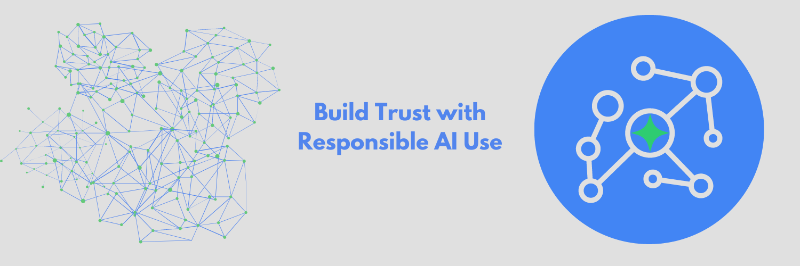
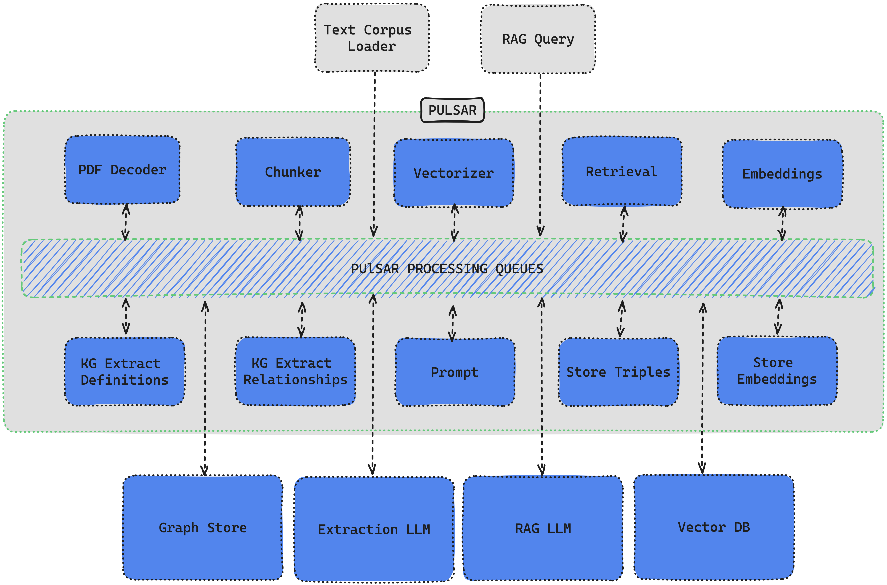

# TrustGraph



🚀 [Full Documentation](https://trustgraph.ai/docs/getstarted)
💬 [Join the Discord](https://discord.gg/AXpxVjwzAw)
📖 [Read the Blog](https://blog.trustgraph.ai)
📺 [YouTube](https://www.youtube.com/@TrustGraph)

## Introduction

TrustGraph deploys a full E2E (end-to-end) AI solution with native GraphRAG in minutes. Autonomous Knowledge Agents build ultra-dense knowlege graphs to fully capture all knowledge context. TrustGraph is designed for maximum flexibility and modularity whether it's calling Cloud LLMs or deploying SLMs On-Device. TrustGraph ingests data to build a RDF style knowledge graph to enable accurate and private `RAG` responses using only the knowledge you want, when you want.

The pipeline processing components are interconnected with a pub/sub engine to maximize modularity for agent integration. The core processing components decode documents, chunk text, create mapped embeddings, generate a RDF knowledge graph, generate AI predictions from either a Cloud LLM or On-Device SLM.

The processing showcases the reliability and efficiences of GraphRAG algorithms which can capture contextual language flags that are missed in conventional RAG approaches. Graph querying algorithms enable retrieving not just relevant knowledge but language cues essential to understanding semantic uses unique to a text corpus.

## Install the TrustGraph CLI

```
pip3 install trustgraph-cli
```

## Download TrustGraph

TrustGraph releases are available [here](https://github.com/trustgraph-ai/trustgraph/releases). Download `deploy.zip` for the desired release version.

| Release Type | Release Version |
| ------------ | --------------- |
| Latest | [0.11.20](https://github.com/trustgraph-ai/trustgraph/releases/download/v0.11.20/deploy.zip) |
| Stable | [0.11.20](https://github.com/trustgraph-ai/trustgraph/releases/download/v0.11.20/deploy.zip) |

TrustGraph is fully containerized and is launched with a `YAML` configuration file. Unzipping the `deploy.zip` will add the `deploy` directory with the following subdirectories:

- `docker-compose`
- `minikube-k8s`
- `gcp-k8s`

Each directory contains the pre-built `YAML` configuration files needed to launch TrustGraph:

| Model Deployment | Graph Store | Launch File |
| ---------------- | ------------ | ----------- |
| AWS Bedrock API | Cassandra | `tg-bedrock-cassandra.yaml` |
| AWS Bedrock API | Neo4j | `tg-bedrock-neo4j.yaml` |
| AzureAI Serverless API | Cassandra | `tg-azure-cassandra.yaml` |
| AzureAI Serverless API | Neo4j | `tg-azure-neo4j.yaml` |
| Anthropic API | Cassandra | `tg-claude-cassandra.yaml` |
| Anthropic API | Neo4j | `tg-claude-neo4j.yaml` |
| Cohere API | Cassandra | `tg-cohere-cassandra.yaml` |
| Cohere API | Neo4j | `tg-cohere-neo4j.yaml` |
| Llamafile API | Cassandra | `tg-llamafile-cassandra.yaml` |
| Llamafile API | Neo4j | `tg-llamafile-neo4j.yaml` |
| Ollama API | Cassandra | `tg-ollama-cassandra.yaml` |
| Ollama API | Neo4j | `tg-ollama-neo4j.yaml` |
| OpenAI API | Cassandra | `tg-openai-cassandra.yaml` |
| OpenAI API | Neo4j | `tg-openai-neo4j.yaml` |
| VertexAI API | Cassandra | `tg-vertexai-cassandra.yaml` |
| VertexAI API | Neo4j | `tg-vertexai-neo4j.yaml` |

Launching TrustGraph is as simple as running one line:

**Docker**:
```
docker compose -f <launch-file.yaml> up -d
```

**Kubernetes**:
```
kubectl apply -f <launch-file.yaml>
```

## Core TrustGraph Features

- PDF decoding
- Text chunking
- On-Device SLM inference with [Ollama](https://ollama.com) or [Llamafile](https://github.com/Mozilla-Ocho/llamafile)
- Cloud LLM infernece: `AWS Bedrock`, `AzureAI`, `Anthropic`, `Cohere`, `OpenAI`, and `VertexAI`
- Chunk-mapped vector embeddings with [HuggingFace](https://hf.co) models
- [RDF](https://www.w3.org/TR/rdf12-schema/) Knowledge Extraction Agents
- [Apache Cassandra](https://github.com/apache/cassandra) or [Neo4j](https://neo4j.com/) as the graph store
- [Qdrant](https://qdrant.tech/) as the VectorDB
- Build and load [Knowledge Cores](https://trustgraph.ai/docs/category/knowledge-cores)
- GraphRAG query service
- [Grafana](https://github.com/grafana/) telemetry dashboard
- Module integration with [Apache Pulsar](https://github.com/apache/pulsar/)
- Container orchestration with `Docker`, `Podman`, or `Minikube`

## Architecture



TrustGraph is designed to be modular to support as many Language Models and environments as possible. A natural fit for a modular architecture is to decompose functions into a set of modules connected through a pub/sub backbone. [Apache Pulsar](https://github.com/apache/pulsar/) serves as this pub/sub backbone. Pulsar acts as the data broker managing data processing queues connected to procesing modules.

### Pulsar Workflows

- For processing flows, Pulsar accepts the output of a processing module and queues it for input to the next subscribed module.
- For services such as LLMs and embeddings, Pulsar provides a client/server model.  A Pulsar queue is used as the input to the service.  When processed, the output is then delivered to a separate queue where a client subscriber can request that output.

## Knowledge Agents

TrustGraph extracts knowledge from a text corpus (PDF or text) to an ultra-dense knowledge graph using 3 automonous knowledge agents. These agents focus on individual elements needed to build the RDF knowledge graph. The agents are:

- Topic Extraction Agent
- Entity Extraction Agent
- Node Connection Agent

The agent prompts are built through templates, enabling customized extraction agents for a specific use case. The extraction agents are launched automatically with the loader commands.

PDF file:
```
tg-load-pdf <document.pdf>
```

Text file:
```
tg-load-text <document.txt>
```

## GraphRAG Queries

Once the knowledge graph has been built or a knowledge core has been loaded, GraphRAG queries are launched with a single line:

```
tg-query-graph-rag -q "Write a blog post about the 5 key takeaways from SB1047 and how they will impact AI development."
```

## API documentation

[Developing on TrustGraph using APIs](docs/api/README.md)

## Deploy and Manage TrustGraph

[🚀🙏 Full Deployment Guide 🚀🙏](https://trustgraph.ai/docs/getstarted)

## TrustGraph Developer's Guide

[Developing for TrustGraph](docs/README.development.md)
