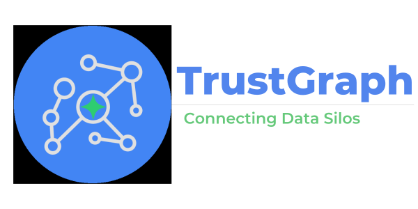
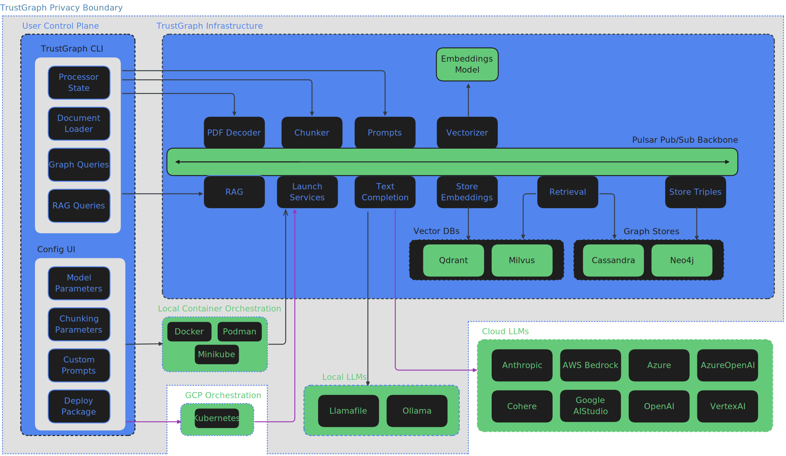

<div align="center">



## Connect Data Silos with Reliable AI

</div>

<div align="center">

[](https://pypi.org/project/trustgraph/) [](https://discord.gg/sQMwkRz5GX)

🚀 [Get Started](https://trustgraph.ai/docs/getstarted) 🧑‍💻 [CLI Docs](https://trustgraph.ai/docs/running/cli) 📋 [Use Cases](https://trustgraph.ai/docs/usecases) 💬 [Join the Discord](https://discord.gg/sQMwkRz5GX) 📺 [YouTube](https://www.youtube.com/@TrustGraph?sub_confirmation=1) 📖 [Blog](https://blog.trustgraph.ai)

</div>

TrustGraph provides all the tools, services, Graph Stores, and VectorDBs needed to deploy reliable, scalable, and accurate AI agents that break down the barriers disconnecting your data. Key features:

- Bulk document ingestion
- Automated Knowledge Graph Building
- Automated Vectorization
- Model Agnostic LLM Integration
- RAG combining both Knowledge Graphs and VectorDBs
- Enterprise Grade Reliability, Scalability, and Modularity
- Data Privacy enablement with local LLM deployments with Ollama and Llamafile

Ingest your sensitive data in batches and build reusable and enhanced knowledge cores that transform general purpose LLMs into knowledge specialists. The observability dashboard allows you to monitor LLM latency, resource management, and token throughput in realtime. Visualize your enhanced data with Neo4j.

## TrustGraph Control Plane

There are two primary ways of interacting with TrustGraph:

- TrustGraph CLI
- Dev Configuration UI

The `TrustGraph CLI` installs the commands for interacting with TrustGraph while running. The `Configuration UI` enables customization of TrustGraph deployments prior to launching.

### Install the TrustGraph CLI

```
pip3 install trustgraph-cli==0.14.15
```

> [!NOTE]
> The `TrustGraph CLI` version must match the desired `TrustGraph` release version.

### Developer Config UI

While TrustGraph is endlessly customizable, the configuration editor can build a custom configuration in seconds with Docker.

[Launch the Developer Config UI 🚀](https://config-ui.demo.trustgraph.ai/)

https://github.com/user-attachments/assets/90eeaea6-82b7-480a-9972-edb66ea99738

Launch Steps:

- For the selected `Model Deployment`, follow the instructions in `Model credentials` section to configure any required environment variables or paths
- Fill in the desired LLM name in the `Model Name` field that corresponds to your selected `Model Deployment`
- Set all desired `Model Parameters`
- Click `GENERATE` under the `Deployment configuration` section
- Follow the instructions under `Launch`

Once `deploy.zip` has been unzipped, launching TrustGraph is as simple as navigating to the `deploy` directory and running:
```
docker compose up -d
```

When finished, shutting down TrustGraph is as simple as:
```
docker compose down -v
```

## TrustGraph Releases

TrustGraph releases are available [here](https://github.com/trustgraph-ai/trustgraph/releases). Download `deploy.zip` for the desired release version.

| Release Type | Release Version |
| ------------ | --------------- |
| Latest | [0.14.15](https://github.com/trustgraph-ai/trustgraph/releases/download/v0.14.15/deploy.zip) |
| Stable | [0.14.15](https://github.com/trustgraph-ai/trustgraph/releases/download/v0.14.15/deploy.zip) |

TrustGraph is fully containerized and is launched with a `YAML` configuration file. Unzipping the `deploy.zip` will add the `deploy` directory with the following subdirectories:

- `docker-compose`
- `minikube-k8s`
- `gcp-k8s`

Each directory contains the pre-built `YAML` configuration files needed to launch TrustGraph:

| Model Deployment | Graph Store | Launch File |
| ---------------- | ------------ | ----------- |
| AWS Bedrock API | Cassandra | `tg-bedrock-cassandra.yaml` |
| AWS Bedrock API | Neo4j | `tg-bedrock-neo4j.yaml` |
| AzureAI API | Cassandra | `tg-azure-cassandra.yaml` |
| AzureAI API | Neo4j | `tg-azure-neo4j.yaml` |
| AzureOpenAI API | Cassandra | `tg-azure-openai-cassandra.yaml` |
| AzureOpenAI API | Neo4j | `tg-azure-openai-neo4j.yaml` |
| Anthropic API | Cassandra | `tg-claude-cassandra.yaml` |
| Anthropic API | Neo4j | `tg-claude-neo4j.yaml` |
| Cohere API | Cassandra | `tg-cohere-cassandra.yaml` |
| Cohere API | Neo4j | `tg-cohere-neo4j.yaml` |
| Google AI Studio API | Cassandra | `tg-googleaistudio-cassandra.yaml` |
| Google AI Studio API | Neo4j | `tg-googleaistudio-neo4j.yaml` |
| Llamafile API | Cassandra | `tg-llamafile-cassandra.yaml` |
| Llamafile API | Neo4j | `tg-llamafile-neo4j.yaml` |
| Ollama API | Cassandra | `tg-ollama-cassandra.yaml` |
| Ollama API | Neo4j | `tg-ollama-neo4j.yaml` |
| OpenAI API | Cassandra | `tg-openai-cassandra.yaml` |
| OpenAI API | Neo4j | `tg-openai-neo4j.yaml` |
| VertexAI API | Cassandra | `tg-vertexai-cassandra.yaml` |
| VertexAI API | Neo4j | `tg-vertexai-neo4j.yaml` |

Once a configuration `launch file` has been selected, deploy TrustGraph with:

**Docker**:
```
docker compose -f <launch-file.yaml> up -d
```

**Kubernetes**:
```
kubectl apply -f <launch-file.yaml>
```

## Core TrustGraph Features

- PDF decoding
- Text chunking
- On-Device SLM inference with [Ollama](https://ollama.com) or [Llamafile](https://github.com/Mozilla-Ocho/llamafile)
- Cloud LLM infernece: `AWS Bedrock`, `AzureAI`, `Anthropic`, `Cohere`, `OpenAI`, and `VertexAI`
- Chunk-mapped vector embeddings with [HuggingFace](https://hf.co) models
- [RDF](https://www.w3.org/TR/rdf12-schema/) Knowledge Extraction Agents
- [Apache Cassandra](https://github.com/apache/cassandra) or [Neo4j](https://neo4j.com/) as the graph store
- [Qdrant](https://qdrant.tech/) as the VectorDB
- Build and load [Knowledge Cores](https://trustgraph.ai/docs/category/knowledge-cores)
- RAG query service using both the Graph Store and VectorDB
- [Grafana](https://github.com/grafana/) telemetry dashboard
- Module integration with [Apache Pulsar](https://github.com/apache/pulsar/)
- Container orchestration with `Docker`, `Podman`, or `Minikube`

## Architecture



TrustGraph is designed to be modular to support as many Language Models and environments as possible. A natural fit for a modular architecture is to decompose functions into a set of modules connected through a pub/sub backbone. [Apache Pulsar](https://github.com/apache/pulsar/) serves as this pub/sub backbone. Pulsar acts as the data broker managing data processing queues connected to procesing modules.

### Pulsar Workflows

- For processing flows, Pulsar accepts the output of a processing module and queues it for input to the next subscribed module.
- For services such as LLMs and embeddings, Pulsar provides a client/server model.  A Pulsar queue is used as the input to the service.  When processed, the output is then delivered to a separate queue where a client subscriber can request that output.

## Knowledge Agents

TrustGraph extracts knowledge from a text corpus (PDF or text) to an ultra-dense knowledge graph using 3 automonous knowledge agents. These agents focus on individual elements needed to build the RDF knowledge graph. The agents are:

- Topic Extraction Agent
- Entity Extraction Agent
- Node Connection Agent

The agent prompts are built through templates, enabling customized extraction agents for a specific use case. The extraction agents are launched automatically with the loader commands.

PDF file:
```
tg-load-pdf <document.pdf>
```

Text or Markdown file:
```
tg-load-text <document.txt>
```

## RAG Queries

Once the knowledge graph and embeddings have been built or a knowledge core has been loaded, RAG queries are launched with a single line:

```
tg-query-graph-rag -q "Write a blog post about the 5 key takeaways from SB1047 and how they will impact AI development."
```

## Deploy and Manage TrustGraph

[🚀 Full Deployment Guide 🚀](https://trustgraph.ai/docs/getstarted)

## TrustGraph Developer's Guide

[Developing for TrustGraph](docs/README.development.md)
