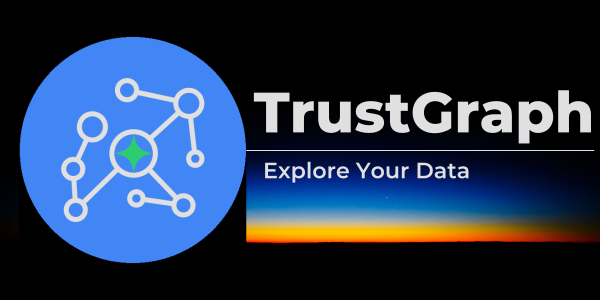

<div align="center">

## See Your Data in a New Light

[](https://pypi.org/project/trustgraph/) [](https://discord.gg/sQMwkRz5GX)

🚀 [Getting Started](https://trustgraph.ai/docs/getstarted) 📺 [YouTube](https://www.youtube.com/@TrustGraphAI?sub_confirmation=1) ⚙️ [API Docs](docs/apis/README.md) 🧑‍💻 [CLI Docs](https://trustgraph.ai/docs/running/cli) 💬 [Discord](https://discord.gg/sQMwkRz5GX) 📖 [Blog](https://blog.trustgraph.ai/subscribe) 📋 [Use Cases](https://trustgraph.ai/docs/usecases)

</div>

TrustGraph is a fully agentic AI system for complex unstructured data. Extract your documents to knowledge graphs and vector embeddings with customizable data extraction agents. Deploy AI agents that analyze your data to understand complex relationships visualized in 3D.

## Key Features

- 📄 **Document Extraction**: Bulk ingest documents such as `.pdf`,`.txt`, and `.md`
- 🪓 **Adjustable Chunking**: Choose your chunking algorithm and parameters
- 🔁 **No-code LLM Integration**: **Anthropic**, **AWS Bedrock**, **AzureAI**, **AzureOpenAI**, **Cohere**, **Google AI Studio**, **Google VertexAI**, **Llamafiles**, **Ollama**, and **OpenAI**
- 📖 **Entity, Topic, and Relationship Knowledge Graphs**
- 🔢 **Mapped Vector Embeddings**
- ❔**No-code GraphRAG Queries**: Automatically perform a semantic similiarity search and subgraph extraction for the context of LLM generative responses
- 🤖 **Agent Flow**: Define custom tools used by a ReAct style Agent Manager that fully controls the response flow including the ability to perform GraphRAG requests
- 📚 **Multiple Knowledge Graph Options**: Full integration with **Memgraph**, **FalkorDB**, **Neo4j**, or **Cassandra**
- 🧮 **Multiple VectorDB Options**: Full integration with **Pinecone**, **Qdrant**, or **Milvus**
- 🎛️ **Production-Grade** reliability, scalability, and accuracy
- 🔍 **Observability**: get insights into system performance with Prometheus and Grafana
- 🗄️ **AI Powered Data Warehouse**: Load only the subgraph and vector embeddings you use most often
- 🪴 **Customizable and Extensible**: Tailor for your data and use cases
- 🖥️ **Configuration Portal**: Build the `YAML` configuration with drop down menus and selectable parameters
- 🕵️ **Data Workbench**: Explore your data with a 3D semantic visualizer

## Getting Started

For developers, **TrustGraph** has the following APIs and CLI:

- [**REST API**](docs/apis/README.md#rest-apis)
- [**Websocket API**](docs/apis/README.md#websocket-api)
- [**Python SDK**](https://trustgraph.ai/docs/api/apistarted)
- [**TrustGraph CLI**](https://trustgraph.ai/docs/running/cli)

See the [API Developer's Guide](#api-documentation) for more information.

For users, **TrustGraph** has the following interfaces:

- [**Configuration Portal**](#configuration-portal)
- [**Data Workbench**](#data-workbench)

The `TrustGraph CLI` installs the commands for interacting with TrustGraph while running along with the Python SDK. The `Configuration Portal` enables customization of TrustGraph deployments prior to launching. The **REST API** can be accessed through port `8088` of the TrustGraph host machine with JSON request and response bodies.

### Install the TrustGraph CLI

```
pip3 install trustgraph-cli==0.19.19
```

> [!NOTE]
> The `TrustGraph CLI` version must match the desired `TrustGraph` release version.

## Configuration Portal

TrustGraph is endlessly customizable by editing the `YAML` launch files. The `Configuration Portal` provides a quick and intuitive tool for building a custom configuration that deploys with Docker, Podman, Minikube, or Google Cloud. There is a `Configuration Portal` for the both the lastest and stable `TrustGraph` releases.

- [**Configuration Portal** (Stable 0.19.19) 🚀](https://config-ui.demo.trustgraph.ai/)
- [**Configuration Portal** (Latest 0.19.19) 🚀](https://dev.config-ui.demo.trustgraph.ai/)

The `Configuration Portal` has 4 important sections:

- **Component Selection** ✅: Choose from the available deployment platforms, LLMs, graph store, VectorDB, chunking algorithm, chunking parameters, and LLM parameters
- **Customization** 🧰: Customize the prompts for the LLM System, Data Extraction Agents, and Agent Flow
- **Data Workbench** 🕵️: Add the **Data Workbench** to the configuration available on port `8888`
- **Finish Deployment** 🚀: Download the launch `YAML` files with deployment instructions

The `Configuration Portal` will generate the `YAML` files in `deploy.zip`. Once `deploy.zip` has been downloaded and unzipped, launching TrustGraph is as simple as navigating to the `deploy` directory and running:

```
docker compose up -d
```

> [!TIP]
> Docker is the recommended container orchestration platform for first getting started with TrustGraph.

When finished, shutting down TrustGraph is as simple as:
```
docker compose down -v
```

## Data Workbench

If added to the build in the `Configuration Portal`, the `Data Workbench` will be available at port `8888`. The `Data Workbench` has 4 capabilities:

- **System Chat** 💬: GraphRAG queries in a chat interface
- **Data Explorer** 🕵️: See semantic relationships in a list structure
- **Data Visualizer** 🌐: Visualize semantic relationships in **3D**
- **Data Loader** 📂: Directly load `.pdf`, `.txt`, or `.md` into the system 

## Example TrustGraph Notebooks

- [**REST API Notebooks**](https://github.com/trustgraph-ai/example-notebooks/tree/master/api-examples)
- [**Python SDK Notebooks**](https://github.com/trustgraph-ai/example-notebooks/tree/master/api-library)

## Prebuilt Configuration Files

TrustGraph `YAML` files are available [here](https://github.com/trustgraph-ai/trustgraph/releases). Download `deploy.zip` for the desired release version.

| Release Type | Release Version |
| ------------ | --------------- |
| Latest | [0.19.19](https://github.com/trustgraph-ai/trustgraph/releases/download/v0.19.19/deploy.zip) |
| Stable | [0.19.19](https://github.com/trustgraph-ai/trustgraph/releases/download/v0.19.19/deploy.zip) |

TrustGraph is fully containerized and is launched with a `YAML` configuration file. Unzipping the `deploy.zip` will add the `deploy` directory with the following subdirectories:

- `docker-compose`
- `minikube-k8s`
- `gcp-k8s`

> [!NOTE]
> As more integrations have been added, the number of possible combinations of configurations has become quite large. It is recommended to use the `Configuration Portal` to build your deployment configuration. Each directory contains `YAML` configuration files for the default component selections.

**Docker**:
```
docker compose -f <launch-file.yaml> up -d
```

**Kubernetes**:
```
kubectl apply -f <launch-file.yaml>
```

## Architecture


TrustGraph is designed to be modular to support as many LLMs and environments as possible. A natural fit for a modular architecture is to decompose functions into a set of modules connected through a pub/sub backbone. [Apache Pulsar](https://github.com/apache/pulsar/) serves as this pub/sub backbone. Pulsar acts as the data broker managing data processing queues connected to procesing modules.

### Pulsar Workflows

- For processing flows, Pulsar accepts the output of a processing module and queues it for input to the next subscribed module.
- For services such as LLMs and embeddings, Pulsar provides a client/server model.  A Pulsar queue is used as the input to the service.  When processed, the output is then delivered to a separate queue where a client subscriber can request that output.

## Data Extraction Agents

TrustGraph extracts knowledge documents to an ultra-dense knowledge graph using 3 automonous data extraction agents. These agents focus on individual elements needed to build the knowledge graph. The agents are:

- Topic Extraction Agent
- Entity Extraction Agent
- Relationship Extraction Agent

The agent prompts are built through templates, enabling customized data extraction agents for a specific use case. The data extraction agents are launched automatically with the loader commands.

PDF file:
```
tg-load-pdf <document.pdf>
```

Text or Markdown file:
```
tg-load-text <document.txt>
```

## GraphRAG Queries

Once the knowledge graph and embeddings have been built or a knowledge core has been loaded, RAG queries are launched with a single line:

```
tg-query-graph-rag -q "Write a blog post about the 5 key takeaways from SB1047 and how they will impact AI development."
```

## Agent Flow

Invoking the Agent Flow will use a ReAct style approach the combines GraphRAG and text completion requests to think through a problem solution.

```
tg-invoke-agent -v -q "Write a blog post about the 5 key takeaways from SB1047 and how they will impact AI development."
```

> [!TIP]
> Adding `-v` to the agent request will return all of the agent manager's thoughts and observations that led to the final response.

## API Documentation

[Developing on TrustGraph using APIs](docs/apis/README.md)

## Deploy and Manage TrustGraph

[🚀🙏 Full Deployment Guide 🚀🙏](https://trustgraph.ai/docs/getstarted)

## TrustGraph Developer's Guide

[Developing for TrustGraph](docs/README.development.md)
