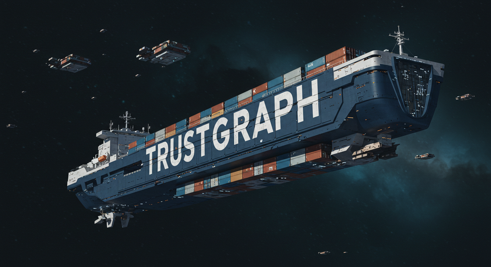

<div align="center">

## The Agent Intelligence Platform

[](https://pypi.org/project/trustgraph/) [](https://discord.gg/sQMwkRz5GX)

📑 [Full Docs](https://docs.trustgraph.ai/docs/TrustGraph) 📺 [YouTube](https://www.youtube.com/@TrustGraphAI?sub_confirmation=1) 🔧 [Configuration Builder](https://config-ui.demo.trustgraph.ai/) ⚙️ [API Docs](docs/apis/README.md) 🧑‍💻 [CLI Docs](https://docs.trustgraph.ai/docs/running/cli) 💬 [Discord](https://discord.gg/sQMwkRz5GX) 📖 [Blog](https://blog.trustgraph.ai/subscribe)

</div>

Build AI Agents you can ***actually*** trust. Define and deploy trustworthy, intelligent AI agents. **TrustGraph** overcomes the "black box" limitations of other platforms by providing a transparent, deploy-anywhere solution with sophisticated GraphRAG that grounds agent responses with accessed-controlled, modular knowledge packages built from your data.

---

<details>
<summary>Table of Contents</summary>
<br>

- 🎯 [**Why TrustGraph?**](#-why-trustgraph)<br>
- 🚀 [**Getting Started**](#-getting-started)<br>
- 🔧 [**Configuration Builder**](#-configuration-builder)<br>
- 🔎 [**TrustRAG**](#-trustrag)<br>
- 🧠 [**Knowledge Cores**](#-knowledge-cores)<br>
- 📐 [**Architecture**](#-architecture)<br>
- 🧩 [**Integrations**](#-integrations)<br>
- 📊 [**Observability & Telemetry**](#-observability--telemetry)<br>
- 🤝 [**Contributing**](#-contributing)<br>
- 📄 [**License**](#-license)<br>
- 📞 [**Support & Community**](#-support--community)<br>

</details>

---

## 🎯 Why TrustGraph?

Deploying truly intelligent and reliable AI agents is challenging. Many platforms are opaque, offer limited control, or rely on simplistic knowledge retrieval that falls short for complex or large datasets. TrustGraph provides a robust, open-source alternative, empowering you to build AI agents that are:

1.  **Grounded in Deep, Interconnected Knowledge (Superior GraphRAG):**
    *   **Go Beyond Basic RAG:** TrustGraph excels at building and leveraging sophisticated **Knowledge Graphs combined with Vector Embeddings** (our "Knowledge Packages"). This allows your agents to access and reason over rich, interconnected information and its explicit relationships, not just semantically similar text fragments.
    *   **Reduced Hallucinations, Higher Accuracy:** Provide your agents with contextually rich information, leading to more accurate, reliable, and trustworthy responses.

2.  **Open, Transparent & Controllable:**
    *   **Escape the Black Box:** As an **open-source platform**, TrustGraph gives you full visibility into its workings. Understand how your data is processed, managed, and utilized by your agents.
    *   **Full Stack Sovereignty:** Deploy the entire TrustGraph platform – including your sensitive Knowledge Packages – wherever you choose: on-premises, private cloud, public cloud, or even bare metal. You maintain ultimate control over your data and AI stack.

3.  **Flexible & Future-Proof:**
    *   **Modular Architecture:** Easily integrate best-of-breed LLMs (cloud APIs or self-hosted via Ollama, TGI, vLLM, etc.), VectorDBs, and Knowledge Graphs. TrustGraph isn't prescriptive; it's adaptable.
    *   **Deploy Anywhere:** Our fully containerized architecture (Docker, Kubernetes) ensures your AI agent solutions can be provisioned consistently across any environment.
    *   **Portable Knowledge Packages:** While tightly integrated, the principles behind our Knowledge Packages are designed for interoperability, giving you more freedom and avoiding deep vendor lock-in for your core data assets.

4.  **Designed for AI Native Intelligence Automation:**
    *   **Automate the Intelligence Supply Chain:** TrustGraph streamlines the end-to-end process of ingesting data, constructing Knowledge Packages, managing them, and delivering that structured knowledge to your AI agents and applications.
    *   **Build Sophisticated Agents:** Leverage capabilities like customizable Knowledge Graph construction and a ReAct Agent Router to develop agents capable of complex reasoning and tool use.

5.  **Cost-Effective & Scalable:**
    *   **Optimize Your AI Spend:** Choose the most cost-effective LLMs, infrastructure, and storage for your needs without being locked into a single provider's ecosystem.
    *   **Scale with Confidence:** Designed to handle growing knowledge bases and increasing agent interaction loads.

**In short, choose TrustGraph if you need to build powerful AI agents that are truly intelligent, transparently auditable, fully under your control, and grounded in the rich, interconnected reality of your unique enterprise knowledge.**

## 🚀 Getting Started
- [Install the CLI](#install-the-trustgraph-cli)
- [Configuration Builder](#-configuration-builder)
- [Platform Restarts](#platform-restarts)
- [Test Suite](#test-suite)
- [Example Notebooks](#example-trustgraph-notebooks)

### Developer APIs and CLI

- [**REST API**](docs/apis/README.md#rest-apis)
- [**Websocket API**](docs/apis/README.md#websocket-api)
- [**Python SDK**](https://trustgraph.ai/docs/api/apistarted)
- [**TrustGraph CLI**](https://trustgraph.ai/docs/running/cli)

See the [API Developer's Guide](#api-documentation) for more information.

For users, **TrustGraph** has the following interfaces:

- [**Configuration Builder**](#-configuration-builder)
- [**Test Suite**](#test-suite)

The `trustgraph-cli` installs the commands for interacting with TrustGraph while running along with the Python SDK. The **Configuration Builder** enables customization of TrustGraph deployments prior to launching. The **REST API** can be accessed through port `8088` of the TrustGraph host machine with JSON request and response bodies.

### Install the TrustGraph CLI

```
pip3 install trustgraph-cli==<trustgraph-version>
```

> [!CAUTION]
> The `trustgraph-cli` version *must* match the selected **TrustGraph** release version. 

## 🔧 Configuration Builder

TrustGraph is endlessly customizable by editing the `YAML` resource files. The **Configuration Builder** provides a tool for building a custom configuration that deploys with your selected orchestration method in your target environment.

- [**Configuration Builder** 🚀](https://config-ui.demo.trustgraph.ai/)

The **Configuration Builder** has 5 important sections:

- 🚢 **TrustGraph Version**: Select the version of TrustGraph you'd like to deploy
- ✅ **Component Selection**: Choose from the available deployment platforms, LLMs, graph store, VectorDB, chunking algorithm, chunking parameters, and LLM parameters
- 🧰 **Customization**: Customize the prompts for the LLM System, Data Extraction Agents, and Agent Flow
- 🕵️ **Test Suite**: Add the **Test Suite** to the configuration available on port `8888`
- 🚀 **Finish Deployment**: Download the launch `YAML` files with deployment instructions

The **Configuration Builder** will generate the `YAML` files in `deploy.zip`. Once `deploy.zip` has been downloaded and unzipped, launching TrustGraph is as simple as navigating to the `deploy` directory and running:

```
docker compose up -d
```

> [!TIP]
> Docker is the recommended container orchestration platform for first getting started with TrustGraph.

When finished, shutting down TrustGraph is as simple as:
```
docker compose down -v
```

### Platform Restarts

The `-v` flag will destroy all data on shut down. To restart the system, it's necessary to keep the volumes. To keep the volumes, shut down without the `-v` flag:
```
docker compose down
```

With the volumes preserved, restarting the system is as simple as:
```
docker compose up -d
```

All data previously in TrustGraph will be saved and usable on restart.

### Test Suite

If added to the build in the **Configuration Builder**, the **Test Suite** will be available at port `8888`. The **Test Suite** has the following capabilities:

- **Graph RAG Chat** 💬: Graph RAG queries in a chat interface
- **Vector Search** 🔎: Semantic similarity search with cosine similarity scores
- **Semantic Relationships** 🕵️: See semantic relationships in a list structure
- **Graph Visualizer** 🌐: Visualize semantic relationships in **3D**
- **Data Loader** 📂: Directly load `.pdf`, `.txt`, or `.md` into the system with document metadata

### Example TrustGraph Notebooks

- [**REST API Notebooks**](https://github.com/trustgraph-ai/example-notebooks/tree/master/api-examples)
- [**Python SDK Notebooks**](https://github.com/trustgraph-ai/example-notebooks/tree/master/api-library)

TrustGraph is fully containerized and is launched with a `YAML` configuration file. Unzipping the `deploy.zip` will add the `deploy` directory with the following subdirectories:

- `docker-compose`
- `minikube-k8s`
- `gcp-k8s`

> [!NOTE]
> As more integrations have been added, the number of possible combinations of configurations has become quite large. It is recommended to use the `Configuration Builder` to build your deployment configuration. Each directory contains `YAML` configuration files for the default component selections.

**Docker**:
```
docker compose -f <launch-file.yaml> up -d
```

**Kubernetes**:
```
kubectl apply -f <launch-file.yaml>
```

TrustGraph is designed to be modular to support as many LLMs and environments as possible. A natural fit for a modular architecture is to decompose functions into a set of modules connected through a pub/sub backbone. [Apache Pulsar](https://github.com/apache/pulsar/) serves as this pub/sub backbone. Pulsar acts as the data broker managing data processing queues connected to procesing modules.

## 🔎 GraphRAG

TrustGraph incorporates **TrustRAG**, an advanced RAG approach that leverages automatically constructed Knowledge Graphs to provide richer and more accurate context to LLMs. Instead of relying solely on unstructured text chunks, TrustRAG understands and utilizes the relationships *between* pieces of information.

**How TrustGraph's GraphRAG Works:**

1.  **Automated Knowledge Graph Construction:**
    *   TrustGraph processes source data to automatically **extract key entities, topics, and the relationships** connecting them.
    *   It then maps these extracted **semantic relationships and concepts to high-dimensional vector embeddings**, capturing the nuanced meaning beyond simple keyword matching.

2.  **Hybrid Retrieval Process:**
    *   When a query is received, TrustRAG first performs a **cosine similarity search** on the vector embeddings to identify potentially relevant concepts and relationships within the knowledge graph.
    *   This initial vector search **pinpoints relevant entry points** within the structured Knowledge Graph.

3.  **Context Generation via Subgraph Traversal:**
    *   Based on the ranked results from the similarity search, TrustRAG dynamically **generates relevant subgraphs**.
    *   It starts from the identified entry points and traverses the connections within the Knowledge Graph. Users can configure the **number of 'hops'** (relationship traversals) to expand the contextual window, gathering interconnected information.
    *   This structured **subgraph**, containing entities and their relationships, forms a highly relevant and context-aware input prompt for the LLM that is endlessly configurable with options for the number of entities, relationships, and overall subgraph size.

## 🧠 Knowledge Packages

One of the biggest challenges currently facing RAG architectures is the ability to quickly reuse and integrate knowledge sets. **TrustGraph** solves this problem by storing the results of the data ingestion process in reusable Knowledge Packages. Being able to store and reuse the Knowledge Packages means the data transformation process has to be run only once. These reusable Knowledge Packages can be loaded back into **TrustGraph** and used for GraphRAG.

A Knowledge Package has two components:

- Set of Graph Edges
- Set of mapped Vector Embeddings

When a Knowledge Package is loaded into TrustGraph, the corresponding graph edges and vector embeddings are queued and loaded into the chosen graph and vector stores.

## 📐 Architecture

TrustGraph provides all the services, stores, control plane, and API gateway needed to connect your data to intelligent agents.


## 🧩 Integrations
TrustGraph provides maximum flexibility so your agents are always powered by the latest and greatest components.

- LLM APIs: **Anthropic**, **AWS Bedrock**, **AzureAI**, **AzureOpenAI**, **Cohere**, **Google AI Studio**, **Google VertexAI**, **Mistral**, and **OpenAI**
- LLM Orchestration: **LM Studio**, **Llamafiles**, **Ollama**, **TGI**, and **vLLM**
- Vector Databases: **Qdrant**, **Pinecone**, and **Milvus**
- Knowledge Graphs: **Memgraph**, **Neo4j**, and **FalkorDB** 
- Data Stores: **Apache Cassandra**
- Observability: **Prometheus** and **Grafana**
- Control Plane: **Apache Pulsar**
- Clouds: **AWS**, **Azure**, **Google Cloud**, **Scaleway**, and **Intel Tiber Cloud**

### Pulsar Control Plane

- For flows, Pulsar accepts the output of a processing module and queues it for input to the next subscribed module.
- For services such as LLMs and embeddings, Pulsar provides a client/server model.  A Pulsar queue is used as the input to the service.  When processed, the output is then delivered to a separate queue where a client subscriber can request that output.

### Data Transformation Agents

TrustGraph transforms data to an ultra-dense knowledge graph using 3 automonous data transformation agents. These agents focus on individual elements needed to build the knowledge graph. The agents are:

- Topic Extraction Agent
- Entity Extraction Agent
- Relationship Extraction Agent

The agent prompts are built through templates, enabling customized data extraction agents for a specific use case. The data extraction agents are launched automatically with the loader commands.

PDF file:
```
tg-load-pdf <document.pdf>
```

Text or Markdown file:
```
tg-load-text <document.txt>
```

### GraphRAG Queries

Once the knowledge graph and embeddings have been built or a cognitive core has been loaded, RAG queries are launched with a single line:

```
tg-invoke-graph-rag -q "What are the top 3 takeaways from the document?"
```

### Agent Flow

Invoking the Agent Flow will use a ReAct style approach the combines Graph RAG and text completion requests to think through a problem solution.

```
tg-invoke-agent -v -q "Write a blog post on the top 3 takeaways from the document."
```

> [!TIP]
> Adding `-v` to the agent request will return all of the agent manager's thoughts and observations that led to the final response.

## 📊 Observability & Telemetry

Once the platform is running, access the Grafana dashboard at:

```
http://localhost:3000
```

Default credentials are:

```
user: admin
password: admin
```

The default Grafana dashboard tracks the following:

- LLM Latency
- Error Rate
- Service Request Rates
- Queue Backlogs
- Chunking Histogram
- Error Source by Service
- Rate Limit Events
- CPU usage by Service
- Memory usage by Service
- Models Deployed
- Token Throughput (Tokens/second)
- Cost Throughput (Cost/second)

## 🤝 Contributing

[Developing for TrustGraph](docs/README.development.md)

## 📄 License

**TrustGraph** is licensed under [Apache 2.0](https://www.apache.org/licenses/LICENSE-2.0).

   Copyright 2024-2025 TrustGraph

   Licensed under the Apache License, Version 2.0 (the "License");
   you may not use this file except in compliance with the License.
   You may obtain a copy of the License at

       http://www.apache.org/licenses/LICENSE-2.0

   Unless required by applicable law or agreed to in writing, software
   distributed under the License is distributed on an "AS IS" BASIS,
   WITHOUT WARRANTIES OR CONDITIONS OF ANY KIND, either express or implied.
   See the License for the specific language governing permissions and
   limitations under the License.

## 📞 Support & Community
- Bug Reports & Feature Requests: [Discord](https://discord.gg/sQMwkRz5GX)
- Discussions & Questions: [Discord](https://discord.gg/sQMwkRz5GX)
- Documentation: [Docs](https://docs.trustgraph.ai/docs/getstarted)
