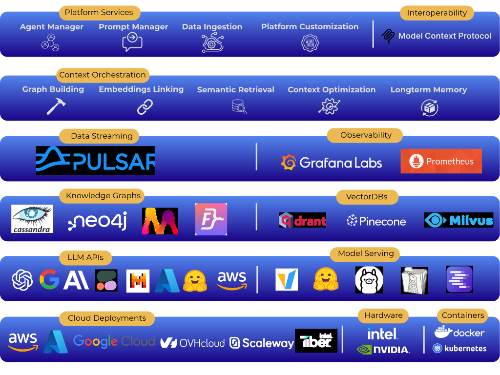

<div align="center">

## The Agentic AI Platform for Enterprise Data Engineers



---

[](https://pypi.org/project/trustgraph/) [](https://discord.gg/sQMwkRz5GX) [](https://deepwiki.com/trustgraph-ai/trustgraph)

[**Docs**](https://docs.trustgraph.ai) | [**YouTube**](https://www.youtube.com/@TrustGraphAI?sub_confirmation=1) | [**Configuration Builder**](https://config-ui.demo.trustgraph.ai/) | [**Discord**](https://discord.gg/sQMwkRz5GX) | [**Blog**](https://blog.trustgraph.ai/subscribe)

</div>

Take control of your data and context with **TrustGraph**. Connect to the latest LLMs or deploy models privately on your hardware. Connect data silos with context automation that builds modular and reusable graph components linked to vector embeddings. Deploy the platform locally, in all major Clouds, and even on bare metal.

<details>
<summary>Table of Contents</summary>
<br>

- [**Why TrustGraph?**](#why-trustgraph)<br>
- [**Agentic MCP Demo**](#agentic-mcp-demo)<br>
- [**Getting Started**](#getting-started)<br>
- [**Configuration Builder**](#configuration-builder)<br>
- [**Context Engineering**](#context-engineering)<br>
- [**Knowledge Cores**](#knowledge-cores)<br>
- [**Platform Architecture**](#platform-architecture)<br>
- [**Integrations**](#integrations)<br>
- [**Observability & Telemetry**](#observability--telemetry)<br>
- [**Contributing**](#contributing)<br>
- [**License**](#license)<br>
- [**Support & Community**](#support--community)<br>

</details>

## Why TrustGraph?

[](https://www.youtube.com/watch?v=Norboj8YP2M)

## Agentic MCP Demo

[](https://www.youtube.com/watch?v=mUCL1b1lmbA)

## Getting Started

- [**Quickstart Guide**](https://docs.trustgraph.ai/getting-started/)
- [**Configuration Builder**](#configuration-builder)
- [**Workbench**](#workbench)
- [**Developer APIs and CLI**](https://docs.trustgraph.ai/reference/)
- [**Example Notebooks**](https://github.com/trustgraph-ai/example-notebooks)
- [**Deployment Guide**](https://docs.trustgraph.ai/deployment/)

### Watch TrustGraph 101

[](https://www.youtube.com/watch?v=rWYl_yhKCng)

## Configuration Builder

The [**Configuration Builder**](https://config-ui.demo.trustgraph.ai/) assembles all of the selected components and builds them into a deployable package. It has 4 sections:

- **Version**: Select the version of TrustGraph you'd like to deploy
- **Component Selection**: Choose from the available deployment platforms, LLMs, graph store, VectorDB, chunking algorithm, chunking parameters, and LLM parameters
- **Customization**: Enable OCR pipelines and custom embeddings models
- **Finish Deployment**: Download the launch `YAML` files with deployment instructions

## Workbench

The **Workbench** is a UI that provides tools for interacting with all major features of the platform. The **Workbench** is enabled by default in the **Configuration Builder** and is available at port `8888` on deployment. The **Workbench** has the following capabilities:

- **Agentic, GraphRAG and LLM Chat**: Chat interface for agentic flows, GraphRAG queries, or directly interfacing with a LLM
- **Semantic Discovery**: Analyze semantic relationships with vector search, knowledge graph relationships, and 3D graph visualization
- **Data Management**: Load data into the **Librarian** for processing, create and upload **Knowledge Packages**
- **Flow Management**: Create and delete processing flow patterns
- **Prompt Management**: Edit all LLM prompts used in the platform during runtime
- **Agent Tools**: Define tools used by the Agent Flow including MCP tools
- **MCP Tools**: Connect to MCP servers

## Context Engineering

TrustGraph features a complete context engineering solution combinging the power of Knowledge Graphs and VectorDBs. Connect your data to automatically construct Knowledge Graphs with mapped Vector Embeddings to deliver richer and more accurate context to LLMs for trustworthy agents.

- **Automated Knowledge Graph Construction:** Data Transformation Agents processes source data to automatically **extract key entities, topics, and the relationships** connecting them. Vector emebeddings are then mapped to these semantic relationships for context retrieval.
- **Hybrid Retrieval:** When an agent needs to perform deep research, it first performs a **cosine similarity search** on the vector embeddings to identify potentially relevant concepts and relationships within the knowledge graph. This initial vector search **pinpoints relevant entry points** within the structured Knowledge Graph.
- **Context Generation via Subgraph Traversal:** Based on the ranked results from the similarity search, agents are provided with only the relevant subgraphs for **deep context**. Users can configure the **number of 'hops'** (relationship traversals) to extend the depth of knowledge availabe to the agents. This structured **subgraph**, containing entities and their relationships, forms a highly relevant and context-aware input prompt for the LLM that is endlessly configurable with options for the number of entities, relationships, and overall subgraph size.

## Knowledge Cores

One of the biggest challenges currently facing RAG architectures is the ability to quickly reuse and integrate knowledge sets like long-term memory for LLMs. **TrustGraph** solves this problem by storing the results of the data ingestion process in reusable Knowledge Cores. Being able to store and reuse the Knowledge Cores means the data transformation process has to be run only once. These reusable Knowledge Cores can be loaded back into **TrustGraph** and used for GraphRAG. Some sample knowledge cores are available for download [here](https://github.com/trustgraph-ai/catalog/tree/master/v3).

A Knowledge Core has two components:

- Set of Graph Edges
- Set of mapped Vector Embeddings

When a Knowledge Core is loaded into TrustGraph, the corresponding graph edges and vector embeddings are queued and loaded into the chosen graph and vector stores.

## Platform Architecture

The platform orchestrates a comprehensive suite of services to transform external data into intelligent, actionable outputs for AI agents and users. It interacts with external data sources and external services (like LLM APIs) via an **API Gateway**.

Within the **TrustGraph** Platform, the services are grouped as follows:

- **Data Orchestration:** This crucial set of services manages the entire lifecycle of ingesting and preparing data to become AI-ready knowledge. It includes **Data Ingest** capabilities for various data types, a *Data Librarian* for managing and cataloging this information, *Data Transformation* services to clean, structure, and refine raw data, and ultimately produces consumable *Knowledge Cores* – the structured, enriched knowledge artifacts for AI.
- **Data Storage:** The platform relies on a flexible storage layer designed to handle the diverse needs of AI applications. This includes dedicated storage for *Knowledge Graphs* (to represent interconnected relationships), *VectorDBs* (for efficient semantic similarity search on embeddings), and *Tabular Datastores* (for structured data).
- **Context Orchestration:** This is the core reasoning engine of the platform. It leverages the structured knowledge from the Storage layer to perform *Deep Knowledge Retrieval* (advanced search and context discovery beyond simple keyword matching) and facilitate *Agentic Thinking*, enabling AI agents to process information and form complex responses or action plans.
- **Agent Orchestration:** This group of services is dedicated to managing and empowering the AI agents themselves. The *Agent Manager* handles the lifecycle, configuration, and operation of agents, while *Agent Tools* provide a framework or library of capabilities that agents can utilize to perform actions or interact with other systems.
- **Private Model Serving:** This layer is responsible for the deployment, management, and operationalization of the various AI models TrustGraph uses or provides to agents. This includes *LLM Deployment*, *Embeddings Deployment*, and *OCR Deployment*. Crucially, it features *Cross Hardware Support*, indicating the platform's ability to run these models across diverse computing environments.
- **Prompt Management:** Effective interaction with AI, especially LLMs and agents, requires precise instruction. This service centralizes the management of all prompt types: *LLM System Prompts* (to define an LLM's persona or core instructions), *Data Transformation Prompts* (to guide AI in structuring data), **RAG Context** generation (providing relevant intelligence to LLMs), and *Agent Definitions* (the core instructions and goals for AI agents).
- **Platform Services:** These foundational services provide the essential operational backbone for the entire TrustGraph platform, ensuring it runs securely, reliably, and efficiently. This includes *Access Controls* (for security and permissions), *Secrets Management* (for handling sensitive credentials), *Logging* (for audit and diagnostics), *Observability* (for monitoring platform health and performance), *Realtime Cost Observability* (for tracking resource consumption expenses), and *Hardware Resource Management* (for optimizing the use of underlying compute).

## Integrations
TrustGraph provides maximum flexibility so your agents are always powered by the latest and greatest components.

<details>
<summary>LLM APIs</summary>
<br>

- Anthropic<br>
- AWS Bedrock<br>
- AzureAI<br>
- AzureOpenAI<br>
- Cohere<br>
- Google AI Studio<br>
- Google VertexAI<br>
- Mistral<br>
- OpenAI<br>

</details>
<details>
<summary>LLM Orchestration</summary>
<br>

- LM Studio<br>
- Llamafiles<br>
- Ollama<br>
- TGI<br>
- vLLM<br>

</details>
<details>
<summary>VectorDBs</summary>
<br>

- Qdrant (default)<br>
- Pinecone<br>
- Milvus<br>

</details>
<details>
<summary>Graph Storage</summary>
<br>

- Apache Cassandra (default)<br>
- Memgraph<br>
- Neo4j<br>
- FalkorDB<br>

</details>
<details>
<summary>Observability</summary>
<br>  

- Prometheus<br>
- Grafana<br>

</details>
<details>
<summary>Control Plane</summary>
<br>

- Apache Pulsar<br>

</details>
<details>
<summary>Clouds</summary>
<br>

- AWS<br>
- Azure<br>
- Google Cloud<br>
- Intel Tiber Cloud<br>
- OVHcloud<br>
- Scaleway<br>

</details>

## Observability & Telemetry

Once the platform is running, access the Grafana dashboard at:

```
http://localhost:3000
```

Default credentials are:

```
user: admin
password: admin
```

The default Grafana dashboard tracks the following:

<details>
<summary>Telemetry</summary>
<br>

- LLM Latency<br>
- Error Rate<br>
- Service Request Rates<br>
- Queue Backlogs<br>
- Chunking Histogram<br>
- Error Source by Service<br>
- Rate Limit Events<br>
- CPU usage by Service<br>
- Memory usage by Service<br>
- Models Deployed<br>
- Token Throughput (Tokens/second)<br>
- Cost Throughput (Cost/second)<br>
   
</details>

## Contributing

[Developer's Guide](https://docs.trustgraph.ai/community/developer.html)

## License

**TrustGraph** is licensed under [Apache 2.0](https://www.apache.org/licenses/LICENSE-2.0).

   Copyright 2024-2025 TrustGraph

   Licensed under the Apache License, Version 2.0 (the "License");
   you may not use this file except in compliance with the License.
   You may obtain a copy of the License at

       http://www.apache.org/licenses/LICENSE-2.0

   Unless required by applicable law or agreed to in writing, software
   distributed under the License is distributed on an "AS IS" BASIS,
   WITHOUT WARRANTIES OR CONDITIONS OF ANY KIND, either express or implied.
   See the License for the specific language governing permissions and
   limitations under the License.

## Support & Community
- Bug Reports & Feature Requests: [Discord](https://discord.gg/sQMwkRz5GX)
- Discussions & Questions: [Discord](https://discord.gg/sQMwkRz5GX)
- Documentation: [Docs](https://docs.trustgraph.ai/)
