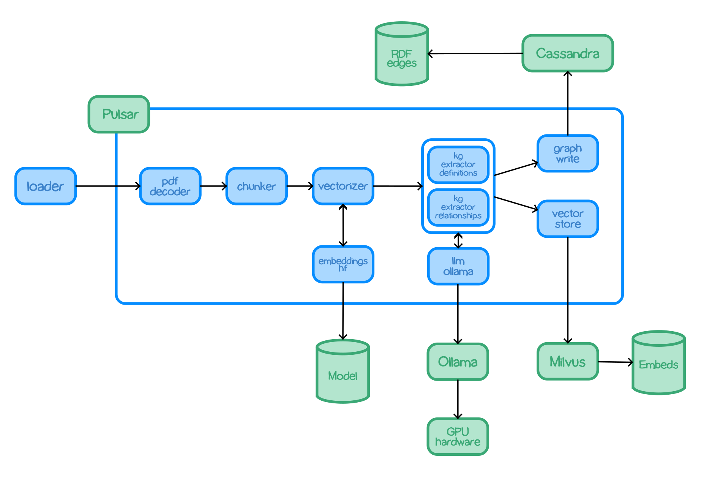

# TrustGraph

## Introduction

TrustGraph provides a means to run a pipeline of flexible AI processing
components in a flexible means to achieve a processing pipeline.

The processing components are interconnected with a pub/sub engine to
make it easier to switch different procesing components in and out, or
to construct different kinds of processing.  The processing components
do things like, decode documents, chunk text, perform embeddings,
apply a local SLM/LLM, call an LLM API, and invoke LLM predictions.

The processing showcases Graph RAG algorithms which can be used to
produce a knowledge graph from documents, which can then be queried by
a Graph RAG query service.

Processing items are executed in containers.  Processing can be scaled-up
by deploying multiple containers.

### Features

- PDF decoding
- Text chunking
- Invocation of LLMs hosted in Ollama
- Invocation of LLMs: Claude, VertexAI and Azure serverless endpoints
- Application of a HuggingFace embeddings algorithm
- Knowledge graph extraction
- Graph edge loading into Cassandra
- Storing embeddings in Milvus
- Embedding query service
- Graph RAG query service
- All procesing integrates with Apache Pulsar
- Containers, so can be deployed using Docker Compose or Kubernetes
- Plug'n'play, switch different LLM modules to suit your LLM options

## Architecture

## Included modules

- `chunker-recursive` - Accepts text documents and uses LangChain recurse
  chunking algorithm to produce smaller text chunks.
- `embeddings-hf` - A service which analyses text and returns a vector
  embedding using one of the HuggingFace embeddings models.
- `embeddings-vectorize` - Uses an embeddings service to get a vector
  embedding which is added to the processor payload.
- `graph-rag` - A query service which applies a Graph RAG algorithm to
  provide a response to a text prompt.
- `graph-write-cassandra` - Takes knowledge graph edges and writes them to
  a Cassandra store.
- `kg-extract-definitions` - knowledge extractor - examines text and
  produces graph edges.
  describing discovered terms and also their defintions.  Definitions are
  derived using the input  documents.
- `kg-extract-relationships` - knowledge extractor - examines text and
  produces graph edges describing the relationships between discovered
  terms.
- `llm-azure-text` - An LLM service which uses an Azure serverless endpoint
  to answer prompts.
- `llm-claude-text` - An LLM service which uses Anthropic Claude
  to answer prompts.
- `llm-ollama-text` -  An LLM service which uses an Ollama service to answer
  prompts.
- `llm-vertexai-text` -  An LLM service which uses VertexAI
  to answer prompts.
- `loader` - Takes a document and loads into the processing pipeline.  Used
  e.g. to add PDF documents.
- `pdf-decoder` - 
- `vector-write-milvus` - 

