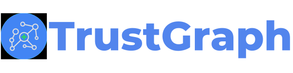

<div align="center">



[](https://pypi.org/project/trustgraph/) 
[](https://discord.gg/sQMwkRz5GX) [](https://deepwiki.com/trustgraph-ai/trustgraph)

[**Website**](https://trustgraph.ai) | [**Docs**](https://docs.trustgraph.ai) | [**YouTube**](https://www.youtube.com/@TrustGraphAI?sub_confirmation=1) | [**Configuration Builder**](https://config-ui.demo.trustgraph.ai/) | [**Discord**](https://discord.gg/sQMwkRz5GX) | [**Blog**](https://blog.trustgraph.ai/subscribe)

<a href="https://trendshift.io/repositories/17291" target="_blank"></a>

# Graph-powered context harness for AI agents

</div>

TrustGraph continuously builds a context graph creating a living context harness, so agents act with connected understanding — not isolated chunks.

Ingest your data into a unified context graph, enrich that graph with ontologies, and serve that graph as structured context to your agents and applications. Instead of letting LLMs guess from flat text, TrustGraph harnesses your graph so every response, tool call, and decision is driven by connected context.

TrustGraph gives you a graph-backed context harness with:

- a context graph over your data (nodes, edges, embeddings)
- graphs built to your ontologies and protocols
- GraphRAG APIs for context-aware retrieval
- an agent harness that lets LLMs query, traverse, and update the graph with isolated collections and modular context cores

Use it as the context layer under any model or agent framework with model inferencing for open models on Nvidia, AMD, or Intel hardware.

<details>
<summary>Table of Contents</summary>
<br>

- [**Key Features**](#key-features)<br>
- [**What is a Context Graph?**](#what-is-a-context-graph)<br>
- [**Why TrustGraph?**](#why-trustgraph)<br>
- [**Getting Started**](#getting-started)<br>
- [**Configuration Builder**](#configuration-builder)<br>
- [**Context Cores**](#context-cores)<br>
- [**Integrations**](#integrations)<br>
- [**Observability & Telemetry**](#observability--telemetry)<br>
- [**Contributing**](#contributing)<br>
- [**License**](#license)<br>
- [**Support & Community**](#support--community)<br>

</details>

## Key Features

- **Ontology-Driven Context Engineering**
- **Unify Data Silos into a Single Context Graph**
- **Automated Context Graph Construction and Retrieval**
- **3D GraphViz**
- **Single Agent or Multi-Agent Systems**
- **Interoperability with MCP**
- **Run Anywhere from local to cloud**
- **Observability and Telemetry**
- **Serve Models for Private LLM Inference**
- **Create Custom Workflows**
- **Control Data Access for Users and Agents**
- **Backend Orchestration for Context Graphs, Datastores, and File and Object Storage**
- **High Throughput Data Streaming**
- **Fully Containerized**

## What is a Context Graph?

[](https://www.youtube.com/watch?v=gZjlt5WcWB4) 

## Why TrustGraph?

[](https://www.youtube.com/watch?v=Norboj8YP2M)

## Getting Started

- [**Quickstart Guide**](https://docs.trustgraph.ai/getting-started)
- [**Configuration Builder**](#configuration-builder)
- [**Workbench**](#workbench)
- [**Developer APIs and CLI**](https://docs.trustgraph.ai/reference)
- [**Deployment Guide**](https://docs.trustgraph.ai/deployment)

### Watch TrustGraph 101

[](https://www.youtube.com/watch?v=rWYl_yhKCng)

## Configuration Builder

The [**Configuration Builder**](https://config-ui.demo.trustgraph.ai/) assembles all of the selected components and builds them into a deployable package. It has 4 sections:

- **Version**: Select the version of TrustGraph you'd like to deploy
- **Component Selection**: Choose from the available deployment platforms, LLMs, graph store, VectorDB, chunking algorithm, chunking parameters, and LLM parameters
- **Customization**: Enable OCR pipelines and custom embeddings models
- **Finish Deployment**: Download the launch `YAML` files with deployment instructions

## Workbench

The **Workbench** provides tools for all major features of TrustGraph. The **Workbench** is on port `8888` by default.

- **Vector Search**: Search the installed knowledge bases
- **Agentic, GraphRAG and LLM Chat**: Chat interface for agents, GraphRAG queries, or direct to LLMs
- **Relationships**: Analyze deep relationships in the installed knowledge bases
- **Graph Visualizer**: 3D GraphViz of the installed knowledge bases
- **Library**: Staging area for installing knowledge bases
- **Flow Classes**: Workflow preset configurations
- **Flows**: Create custom workflows and adjust LLM parameters during runtime
- **Knowledge Cores**: Manage resuable knowledge bases
- **Prompts**: Manage and adjust prompts during runtime
- **Schemas**: Define custom schemas for structured data knowledge bases
- **Ontologies**: Define custom ontologies for unstructured data knowledge bases
- **Agent Tools**: Define tools with collections, knowledge cores, MCP connections, and tool groups
- **MCP Tools**: Connect to MCP servers

## TypeScript Library for UIs

There are 3 libraries for quick UI integration of TrustGraph services.

- [@trustgraph/client](https://www.npmjs.com/package/@trustgraph/client)
- [@trustgraph/react-state](https://www.npmjs.com/package/@trustgraph/react-state)
- [@trustgraph/react-provider](https://www.npmjs.com/package/@trustgraph/react-provider)

## Context Cores

A challenge facing GraphRAG architectures is the ability to reuse and remove context from agent workflows. TrustGraph can build modular and reusable Context Cores. Context cores can be loaded and removed during runtime. Some sample context cores are [here](https://github.com/trustgraph-ai/catalog/tree/master/v3).

A Context Core has two components:

- Context graph triples
- Vector embeddings mapped to the context graph

## Integrations
TrustGraph provides component flexibility to optimize agent workflows.

<details>
<summary>LLM APIs</summary>
<br>

- Anthropic<br>
- AWS Bedrock<br>
- AzureAI<br>
- AzureOpenAI<br>
- Cohere<br>
- Google AI Studio<br>
- Google VertexAI<br>
- Mistral<br>
- OpenAI<br>

</details>
<details>
<summary>LLM Orchestration</summary>
<br>

- LM Studio<br>
- Llamafiles<br>
- Ollama<br>
- TGI<br>
- vLLM<br>

</details>
<details>
<summary>Graph Storage</summary>
<br>

- Apache Cassandra (default)<br>
- Neo4j<br>
- Memgraph<br>
- FalkorDB<br>

</details>
<details>
<summary>VectorDBs</summary>
<br>

- Qdrant (default)<br>
- Pinecone<br>
- Milvus<br>

</details>
<details>
<summary>File and Object Storage</summary>
<br>

- Garage (default)<br>
- MinIO<br>

</details>
<details>
<summary>Observability</summary>
<br>  

- Prometheus<br>
- Grafana<br>

</details>
<details>
<summary>Control Plane</summary>
<br>

- Apache Pulsar<br>

</details>
<details>
<summary>Clouds</summary>
<br>

- AWS<br>
- Azure<br>
- Google Cloud<br>
- OVHcloud<br>
- Scaleway<br>

</details>

## Observability & Telemetry

Once the platform is running, access the Grafana dashboard at:

```
http://localhost:3000
```

Default credentials are:

```
user: admin
password: admin
```

The default Grafana dashboard tracks the following:

<details>
<summary>Telemetry</summary>
<br>

- LLM Latency<br>
- Error Rate<br>
- Service Request Rates<br>
- Queue Backlogs<br>
- Chunking Histogram<br>
- Error Source by Service<br>
- Rate Limit Events<br>
- CPU usage by Service<br>
- Memory usage by Service<br>
- Models Deployed<br>
- Token Throughput (Tokens/second)<br>
- Cost Throughput (Cost/second)<br>
   
</details>

## Contributing

[Developer's Guide](https://docs.trustgraph.ai/community/developer.html)

## License

**TrustGraph** is licensed under [Apache 2.0](https://www.apache.org/licenses/LICENSE-2.0).

   Copyright 2024-2025 TrustGraph

   Licensed under the Apache License, Version 2.0 (the "License");
   you may not use this file except in compliance with the License.
   You may obtain a copy of the License at

       http://www.apache.org/licenses/LICENSE-2.0

   Unless required by applicable law or agreed to in writing, software
   distributed under the License is distributed on an "AS IS" BASIS,
   WITHOUT WARRANTIES OR CONDITIONS OF ANY KIND, either express or implied.
   See the License for the specific language governing permissions and
   limitations under the License.

## Support & Community
- Bug Reports & Feature Requests: [Discord](https://discord.gg/sQMwkRz5GX)
- Discussions & Questions: [Discord](https://discord.gg/sQMwkRz5GX)
- Documentation: [Docs](https://docs.trustgraph.ai/)
