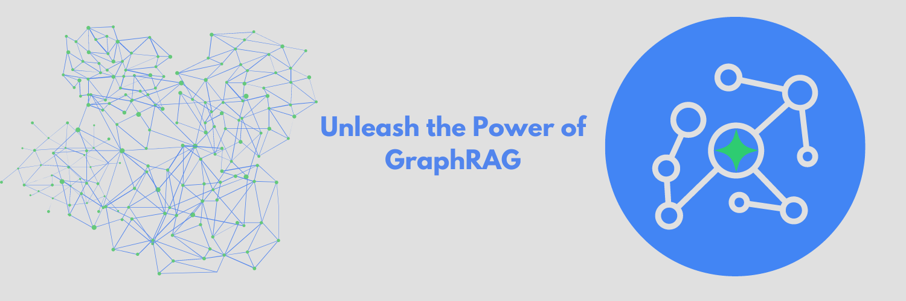

# TrustGraph



🚀 [Full Documentation](https://trustgraph.ai/docs/getstarted)
💬 [Join the Discord](https://discord.gg/AXpxVjwzAw)
📖 [Read the Blog](https://blog.trustgraph.ai)
📺 [YouTube](https://www.youtube.com/@TrustGraph)

## Introduction

TrustGraph deploys a full E2E (end-to-end) AI solution with native GraphRAG in minutes. TrustGraph is designed for maximum flexibility and modularity whether it's calling Cloud LLMs or deploying SLMs On-Device. TrustGraph ingests data to build a RDF style knowledge graph to enable accurate and private `RAG` responses using only the knowledge you want, when you want.

The pipeline processing components are interconnected with a pub/sub engine to maximize modularity for agent integration. The core processing components decode documents, chunk text, create mapped embeddings, generate a RDF knowledge graph, generate AI predictions from either a Cloud LLM or On-Device SLM.

The processing showcases the reliability and efficiences of GraphRAG algorithms which can capture contextual language flags that are missed in conventional RAG approaches. Graph querying algorithms enable retrieving not just relevant knowledge but language cues essential to understanding semantic uses unique to a text corpus.

## Deploy in Minutes

TrustGraph is designed to deploy all the services and stores needed for a scalable GraphRAG infrastructure as quickly and simply as possible.

### Install Requirements

```
python3 -m venv env
. env/bin/activate
pip3 install pulsar-client
pip3 install cassandra-driver
export PYTHON_PATH=.
```

### Download TrustGraph

```
git clone https://github.com/trustgraph-ai/trustgraph trustgraph
cd trustgraph
```

TrustGraph is fully containerized and is launched with a Docker Compose `YAML` file. These files are prebuilt and included in the download main directory. Simply select the file that matches your desired model deployment and graph store configuration.

| Model Deployment | Graph Store | Launch File |
| ---------------- | ------------ | ----------- |
| AWS Bedrock | Cassandra | `tg-launch-bedrock-cassandra.yaml` |
| AWS Bedrock | Neo4j | `tg-launch-bedrock-neo4j.yaml` |
| AzureAI Serverless Endpoint | Cassandra | `tg-launch-azure-cassandra.yaml` |
| AzureAI Serverless Endpoint | Neo4j | `tg-launch-azure-neo4j.yaml` |
| Anthropic API | Cassandra | `tg-launch-claude-cassandra.yaml` |
| Anthropic API | Neo4j | `tg-launch-claude-neo4j.yaml` |
| Cohere API | Cassandra | `tg-launch-cohere-cassandra.yaml` |
| Cohere API | Neo4j | `tg-launch-cohere-neo4j.yaml` |
| Llamafile | Cassandra | `tg-launch-llamafile-cassandra.yaml` |
| Llamafile | Neo4j | `tg-launch-llamafile-neo4j.yaml` |
| Mixed Depoloyment | Cassandra | `tg-launch-mix-cassandra.yaml` |
| Mixed Depoloyment | Neo4j | `tg-launch-mix-neo4j.yaml` |
| Ollama | Cassandra | `tg-launch-ollama-cassandra.yaml` |
| Ollama | Neo4j | `tg-launch-ollama-neo4j.yaml` |
| OpenAI | Cassandra | `tg-launch-openai-cassandra.yaml` |
| OpenAI | Neo4j | `tg-launch-openai-neo4j.yaml` |
| VertexAI | Cassandra | `tg-launch-vertexai-cassandra.yaml` |
| VertexAI | Neo4j | `tg-launch-vertexai-neo4j.yaml` |

Launching TrustGraph is as simple as running one line:

```
docker compose -f <launch-file> up -d
```

## Core TrustGraph Features

- PDF decoding
- Text chunking
- On-Device SLM inference with [Ollama](https://ollama.com) or [Llamafile](https://github.com/Mozilla-Ocho/llamafile)
- Cloud LLM infernece: `AWS Bedrock`, `AzureAI`, `Anthropic`, `Cohere`, `OpenAI`, and `VertexAI`
- Chunk-mapped vector embeddings with [HuggingFace](https://hf.co) models
- [RDF](https://www.w3.org/TR/rdf12-schema/) style Knowledge Graph extraction
- [Apache Cassandra](https://github.com/apache/cassandra) or [Neo4j](https://neo4j.com/) as the graph store
- [Qdrant](https://qdrant.tech/) as the VectorDB
- Build and load [Knowledge Cores](https://trustgraph.ai/docs/category/knowledge-cores)
- GraphRAG query service
- [Grafana](https://github.com/grafana/) telemetry dashboard
- Module integration with [Apache Pulsar](https://github.com/apache/pulsar/)
- Container orchestration with `Docker` or [Podman](http://podman.io/)

## Architecture


TrustGraph is designed to be modular to support as many Language Models and environments as possible. A natural fit for a modular architecture is to decompose functions into a set of modules connected through a pub/sub backbone. [Apache Pulsar](https://github.com/apache/pulsar/) serves as this pub/sub backbone. Pulsar acts as the data broker managing data processing queues connected to procesing modules.

### Pulsar Workflows

- For processing flows, Pulsar accepts the output of a processing module and queues it for input to the next subscribed module.
- For services such as LLMs and embeddings, Pulsar provides a client/server model.  A Pulsar queue is used as the input to the service.  When processed, the output is then delivered to a separate queue where a client subscriber can request that output.

## Naive Knowledge Extraction

TrustGraph extracts knowledge from a text corpus (PDF or text) to a knowledge graph using 3 parallel processes. These processes focus on individual elements needed to build a rich RDF knowledge graph. The extraction focuses on:

- Topics
- Entities
- Semantic Relationships

The extraction prompts are built through templates, enabling customized extraction processes for a specific use case. The extraction process is launched automatically with either of following commands pointing to the path of a desired text corpus or the included sample file:

```
scripts/load-pdf -f sample-text-corpus.pdf
scripts/load-text -f sample-text-corpus.txt
```

## GraphRAG Queries

Once the knowledge graph has been built or a knowledge core has been loaded, GraphRAG queries are launched with a single line:

```
scripts/query-graph-rag -q "Write a blog post about the 5 key takeaways from SB1047 and how they will impact AI development."
```

## Deploy and Manage TrustGraph

[🚀 Full Deployment Guide 🚀](https://trustgraph.ai/docs/getstarted)

## TrustGraph Developer's Guide

[Developing for TrustGraph](docs/README.development.md)
