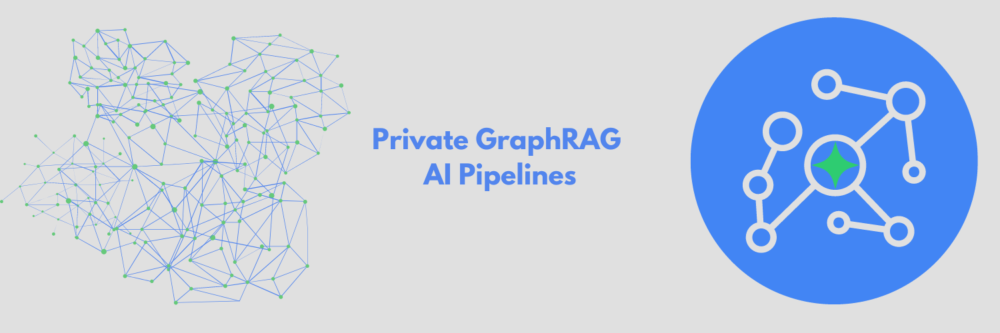

# TrustGraph

🚀 [Get Started](https://trustgraph.ai/docs/getstarted)
💬 [Join the Discord](https://discord.gg/AXpxVjwzAw)
📖 [Read the Blog](https://blog.trustgraph.ai)

## Introduction

TrustGraph deploys a full E2E (end-to-end) AI solution with native GraphRAG in minutes. TrustGraph is designed for maximum flexibility and modularity whether it's calling Cloud LLMs or deploying SLMs On-Device. TrustGraph ingests data to build a RDF style knowledge graph to enable accurate and private `RAG` responses using only the knowledge you want, when you want.

The pipeline processing components are interconnected with a pub/sub engine to maximize modularity for agent integration. The core processing components decode documents, chunk text, perform embeddings, apply an On-Device SLM/LLM, call a LLM API, and generate LM predictions.

The processing showcases the reliability and efficiences of GraphRAG algorithms which can capture contextual language flags that are missed in conventional RAG approaches. Graph querying algorithms enable retrieving not just relevant knowledge but language cues essential to understanding semantic uses unique to a text corpus.

Processing modules are executed in containers.  Processing can be scaled-up by deploying multiple containers.

### Features

- PDF decoding
- Text chunking
- Inference of On-Device SLMs deployed with [Ollama](https://ollama.com) or [Llamafile](https://github.com/Mozilla-Ocho/llamafile)
- Inference of Cloud LLMs: `AWS Bedrock`, `AzureAI`, `Anthropic`, `Cohere`, `OpenAI`, and `VertexAI`
- Mixed model deployments
- Application of a [HuggingFace](https://hf.co) embeddings models
- [RDF](https://www.w3.org/TR/rdf12-schema/) aligned Knowledge Graph extraction
- Graph edge loading into [Apache Cassandra](https://github.com/apache/cassandra) or [Neo4j](https://neo4j.com/)
- Storing embeddings in [Qdrant](https://qdrant.tech/)
- Build and load [Knowledge Cores](https://trustgraph.ai/docs/category/knowledge-cores)
- Embedding query service
- GraphRAG query service
- All procesing integrates with [Apache Pulsar](https://github.com/apache/pulsar/)
- Containers deployed using `Docker` or [Podman](http://podman.io/)
- Maximum modularity: switch different LM modules to suit your needs

## Architecture

TrustGraph is designed to be modular to support as many Language Models and environments as possible. A natural fit for a modular architecture is to decompose functions into a set modules connected through a pub/sub backbone. [Apache Pulsar](https://github.com/apache/pulsar/) serves as this pub/sub backbone. Pulsar acts as the data broker managing inputs and outputs between modules.

**Pulsar Workflows**:

- For processing flows, Pulsar accepts the output of a processing module and queues it for input to the next subscribed module.
- For services such as LLMs and embeddings, Pulsar provides a client/server model.  A Pulsar queue is used as the input to the service.  When processed, the output is then delivered to a separate queue where a client subscriber can request that output.

The entire architecture, the pub/sub backbone and set of modules, is bundled into a single Python package. A container image with the package installed can also run the entire architecture.

## Core Modules

- `chunker-recursive` - Accepts text documents and uses LangChain recursive chunking algorithm to produce smaller text chunks.
- `chunker-token` - Chunks texts documents by a chosen amount of tokens.
- `embeddings-hf` - A service which analyses text and returns a vector embedding using one of the HuggingFace embeddings models.
- `embeddings-ollama` - A service which analyses text and returns a vector embedding using an Ollama embeddings model.
- `embeddings-vectorize` - Uses an embeddings service to get a vector embedding which is added to the processor payload.
- `graph-rag` - A query service which applies a GraphRAG algorithm to provide a response to a text prompt.
- `triples-write-cassandra` - Takes knowledge graph edges and writes them to a Cassandra store.
- `triples-write-neo4j` - Takes knowledge graph edges and writes them to a Neo4j store.
- `kg-extract-definitions` - knowledge extractor - examines text and produces graph edges. describing discovered terms and also their defintions.  Definitions are derived using the input documents.
- `kg-extract-relationships` - knowledge extractor - examines text and produces graph edges describing the relationships between discovered terms.
- `kg-extract-topics` - knowledge extractor - examines text and produces graph edges describing conceptual terms.
- `load-pdf` - Takes a PDF and loads into the processing pipeline.
- `load-text` - Takes a .txt file and loads into the processing pipeline.
- `pdf-decoder` - Takes a PDF doc and emits text extracted from the document. Text extraction from PDF is not a perfect science as PDF is a printable format.  For instance, the wrapping of text between lines in a PDF document is not semantically encoded, so the decoder will see wrapped lines as space-separated.
- `ge-write-qdrant` - Takes graph embeddings mappings and records them in the vector embeddings store.

## LM Specific Modules

- `text-completion-azure` - Sends request to AzureAI serverless endpoint
- `text-completion-bedrock` - Send request to AWS Bedrock API
- `text-completion-claude` - Sends request to Anthropic's API
- `text-completion-cohere` - Send request to Cohere's API
- `text-completion-llamafile` - Sends request to On-Device Llamafile
- `text-completion-ollama` - Sends request to On-Device LM running using Ollama
- `text-completion-openai` - Sends request to OpenAI's API
- `text-completion-vertexai` - Sends request to model available through VertexAI API

## Deploy TrustGraph

[🚀 Quickstart 🚀](https://trustgraph.ai/docs/getstarted)

## TrustGraph Developer's Guide

See [Development on trustgraph](docs/README.development.md)
