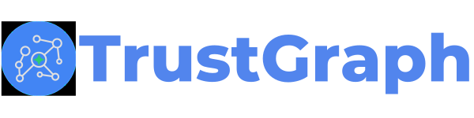

<div align="center">



[](https://pypi.org/project/trustgraph/)  
[](https://discord.gg/sQMwkRz5GX) [](https://deepwiki.com/trustgraph-ai/trustgraph)

[**Website**](https://trustgraph.ai) | [**Docs**](https://docs.trustgraph.ai) | [**YouTube**](https://www.youtube.com/@TrustGraphAI?sub_confirmation=1) | [**Configuration Terminal**](https://config-ui.demo.trustgraph.ai/) | [**Discord**](https://discord.gg/yUWRkfbD) | [**Blog**](https://blog.trustgraph.ai/subscribe)

### The Anti-Palantir

<a href="https://trendshift.io/repositories/17291" target="_blank"></a>

**Open Source · Open Standards · Total Transparency**

[**Request Access to the Playground Preview**](https://docs.google.com/forms/d/e/1FAIpQLSeTnF22ZjUP20FWV--VvS5606x-5cOvnKty6AqcPdtlnPuqbQ/viewform)
</div>

---

Write context once. Run agents anywhere. Own your data and the models.

Stop rebuilding context from scratch. TrustGraph treats context as a holon — a modular, independent whole that naturally snaps into a larger domain-wide intelligence layer. By deploying context as holonic context graphs, TrustGraph powers multi-tenant agent workflows, dramatically reduces token consumption, and aligns with semantic web standards (RDF, OWL, SKOS, SHACL). Version your context, share it across teams, and scale with full provenance.

## What TrustGraph Does

TrustGraph is a complete holonic context harness for all LLMs. It provides the full infrastructure layer underneath your agents: knowledge ingestion, structured storage, graph-grounded retrieval, agent orchestration, and a full LLM inferencing stack.

TrustGraph relies on absolutely no 3rd party services aside from optional API integrations to cloud-hosted LLMs. Whether you are using Anthropic's or OpenAI's API, or self-hosting Qwen3.7 via vLLM, TrustGraph handles it all with pre-built API connectors and a full LLM inferencing stack to enrich the models with a sovereign, private holonic system that grounds your agents in reality.

## The Problem: Why Agents Break

When you build an AI agent today, you spend most of your time fighting context:

- **RAG retrieves fragments, not meaning**. Chunks of text have no structure. Relationships between facts are invisible. Your agent guesses at the connections.

- **Context is disposable**. What the agent learned in one session is gone in the next. There is no persistent, structured knowledge layer underneath.

- **Answers aren't traceable**. You can't explain why the agent said what it said, which means you can't trust it in production.

- **Knowledge can't be reused**. You rebuild the same context pipelines for every new project, every new agent, every new environment.

These aren't retrieval problems. They are structural problems. Context needs to be organized, versioned, and composable — exactly the way software infrastructure is.

## The Solution: A Holonic Context System
The philosopher Arthur Koestler coined the word [holon](https://en.wikipedia.org/wiki/Holon_(philosophy)) to describe something that is simultaneously a whole in itself and a part of something larger. A fact is whole. It is also part of a domain. A domain is whole. It is also part of an organization's knowledge.

AI agents break down because this holonic structure is never built. Context gets shoved into flat text windows, scattered across vector stores, or hardwired into one-off prompts. Facts lose their relationships.

TrustGraph solves this by organizing your domain into holonic context graphs. Entities, relationships, and evidence are treated as first-class objects. Every agent query is grounded against these holons—marrying symbolic graph structures with vector embeddings. Every answer carries provenance. Every fact is traceable.

## Context Cores: Knowledge as a First-Class Citizen

A Context Core is the deployable unit of knowledge in TrustGraph. It packages everything an agent needs to reason reliably over a domain into a single, portable artifact.

### What's inside a Context Core
- **Ontology** — your domain schema and entity mappings
- **Holon** — entities, relationships, and supporting evidence
- **Embeddings** — vector indexes for fast semantic entry-point lookup
- **Provenance** — where every fact came from, when, and how it was derived
- **Retrieval policies** — traversal rules, freshness controls, authority ranking

Context Cores decouple what agents know from how agents are deployed. Build once. Run in Docker locally, Kubernetes in production, or on any cloud. Pin a version. Roll back. Promote across environments. This is context engineering — and it works because knowledge is finally treated like the infrastructure it is.

## Explainability: Trust Your Agents in Production
LLMs are black boxes, and traditional RAG makes it worse. When an agent pulls flat text chunks from a vector store, you have no idea how it connected those fragments to form an answer. You cannot ship agents to production if you can't explain why they said what they said.

### How TrustGraph makes agents explainable:

- **Traceable Reasoning Paths**: Instead of guessing at connections between text chunks, TrustGraph traverses explicit relationship paths in the holonic context graph. You can inspect exactly which entities, relationships, and sub-graphs were pulled into the LLM's context window to generate a given response.
- **Fact-Level Provenance**: Every node and edge in the graph carries strict provenance. When an agent makes a claim, you can trace it back to the exact source document, the time it was ingested, and the extraction method used to derive it.
- **No Black-Box Guesses**: By grounding the LLM in a structured, symbolic graph, you eliminate the hallucinations that occur when models are forced to infer relationships from unstructured text. If a fact isn't in the graph, the agent doesn't use it.

TrustGraph doesn't just give you answers - it gives you the receipt. Every fact is traceable, every connection is visible, and every output is verifiable.

## Workspaces, Collections, and Flows

TrustGraph has a [three-level system](https://docs.trustgraph.ai/overview/workspaces) for organizing and isolating knowledge. 

A `Workspace` is the outermost boundary — a fully isolated tenancy scope where all data, users, configuration, and pipelines live independently from every other workspace. Isolation is structural: enforced at the pub/sub queue, storage, and API gateway layers, not by trusting a field in a message body.

Within a workspace, a `Collection` groups related holons, graph structures, embeddings, and documents together — think of it as a dedicated shelf in a library, scoped to a specific domain, project, or customer.

A `Flow` is a running data processing pipeline that defines how raw data moves through ingestion, extraction, structuring, and storage — the assembly line that turns documents into queryable knowledge. Together, the three layers let you run multiple isolated tenants on a single deployment, separate knowledge by domain within each tenant, and process that knowledge through fully configurable pipelines — all without restarting the system or rebuilding your infrastructure.

## The Full Stack
TrustGraph is not a wrapper around a graph database. It is the complete backend for production agentic systems.

- **Holonic context graph engine**: automated entity and relationship extraction, ontology-driven graph construction, graph-grounded retrieval for explainable outputs
- **Multi-model database**: tabular/relational, key-value, document, graph, vectors, images, video, and audio — all managed in Cassandra and S3-compatible Garage
- **Out-of-the-box RAG pipelines**: DocumentRAG, GraphRAG, and OntologyRAG ready to deploy
- **Fully agentic orchestration**: single or multi-agent, ReAct, Plan-then-Execute, Supervisor patterns, and MCP integration
- **3D Knowledge Explorer**: interactive graph visualization with BFS neighborhood extraction and edge pulse animation
- **Automated data ingest**: quick ingest with semantic similarity or ontology-structured precision retrieval
- **Run anywhere**: Docker/Podman locally, Kubernetes in the cloud

All major LLMs — Anthropic, Cohere, Gemini, Mistral, OpenAI, and more via API.

vLLM, Ollama, TGI, LM Studio, and Llamafiles for fully local inferencing.

Verified cloud deployments for Alibaba Cloud, AWS, Azure, GCP, OVHcloud, and Scaleway.
     
## No API Keys Required

How many times have you cloned a repo and opened the `.env.example` to see the dozens of API keys for 3rd party dependencies needed to make the services work? There are only 3 things in TrustGraph that might need an API key:

- 3rd party LLM services like Anthropic, Cohere, Gemini, Mistral, OpenAI, etc.
- 3rd party OCR like Mistral OCR
- The API key *you set* for the TrustGraph API gateway

Everything else is included.
- [x] Managed Multi-model storage in [Cassandra](https://cassandra.apache.org/_/index.html)
- [x] Managed Vector embedding storage in [Qdrant](https://github.com/qdrant/qdrant)
- [x] Managed File and Object storage in [Garage](https://github.com/deuxfleurs-org/garage) (S3 compatible)
- [x] Managed High-speed Pub/Sub messaging fabric with [Pulsar](https://github.com/apache/pulsar) or [RabbitMQ](https://www.rabbitmq.com/)
- [x] Complete LLM inferencing stack for open LLMs with [vLLM](https://github.com/vllm-project/vllm), [TGI](https://github.com/huggingface/text-generation-inference), [Ollama](https://github.com/ollama/ollama), [LM Studio](https://github.com/lmstudio-ai), and [Llamafiles](https://github.com/mozilla-ai/llamafile) 

## Quickstart

No need to clone the repo unless you are building from source. TrustGraph deploys as a set of Docker containers. Configure it on the command line in one step:

```
npx @trustgraph/config
```

The config process will generate an app config that can be run locally with Docker, Podman, or Minikube. The process will output:
- `deploy.zip` with either a `docker-compose.yaml` file for a Docker/Podman or `resources.yaml` for Kubernetes
- Deployment instructions as `INSTALLATION.md`

<p align="center">
  <video src="https://github.com/user-attachments/assets/33434c3c-f586-4610-8bb2-d7b7b586a672"
width="80%" controls></video>
</p>

For a browser based configuration, try the [Configuration Terminal](https://config-ui.demo.trustgraph.ai/). 

## Watch What is a Holonic Context Graph?

[](https://www.youtube.com/watch?v=gZjlt5WcWB4) 

## Watch Holonic Context Graphs in Action

[](https://www.youtube.com/watch?v=sWc7mkhITIo)

## Getting Started with TrustGraph

- [**Getting Started Guides**](https://docs.trustgraph.ai/getting-started)
- [**Developer APIs and CLI**](https://docs.trustgraph.ai/reference)
- [**Deployment Guides**](https://docs.trustgraph.ai/deployment)

## TrustGraph UI


The UI provides tools for all major features of TrustGraph. The UI deploys on port `8888` by default.

- **Agent Console** — Query your agents directly with streaming responses and live explainability event tracking, so you can watch reasoning unfold in real time
- **GraphRAG View** — Interactive graph RAG queries with a visual explainability DAG and inline provenance display, making it easy to see exactly where answers came from
- **Context Explorer** — An interactive 3D context graph explorer with dynamic graph loading, BFS neighborhood extraction, edge pulse animation, and multiple navigation views
- **Document Ingestion** — A complete upload and submission workflow with page and chunk inspection and document structure browsing
- **Ontology Workbench** — A full ontology editor with class and property trees, OWL/XML and Turtle import/export with round-trip fidelity, circular dependency detection, and safe-delete confirmation dialogs
- **Schema Workbench** — Interactive schema management with list, create, edit, and delete operations including field and index management
- **Prompt Editor** — A dedicated prompt editing workflow

## TypeScript Library for UIs

There are 3 libraries for quick UI integration of TrustGraph services.

- [@trustgraph/client](https://www.npmjs.com/package/@trustgraph/client)
- [@trustgraph/react-state](https://www.npmjs.com/package/@trustgraph/react-state)
- [@trustgraph/react-provider](https://www.npmjs.com/package/@trustgraph/react-provider)

## Contributing

[Developer's Guide](https://docs.trustgraph.ai/guides/building/introduction.html)

## License

**TrustGraph** is licensed under [Apache 2.0](https://www.apache.org/licenses/LICENSE-2.0).

   Copyright 2024-2026 TrustGraph

   Licensed under the Apache License, Version 2.0 (the "License");
   you may not use this file except in compliance with the License.
   You may obtain a copy of the License at

       http://www.apache.org/licenses/LICENSE-2.0

   Unless required by applicable law or agreed to in writing, software
   distributed under the License is distributed on an "AS IS" BASIS,
   WITHOUT WARRANTIES OR CONDITIONS OF ANY KIND, either express or implied.
   See the License for the specific language governing permissions and
   limitations under the License.

## Support & Community
- Bug Reports & Feature Requests: [Discord](https://discord.gg/sQMwkRz5GX)
- Discussions & Questions: [Discord](https://discord.gg/sQMwkRz5GX)
- Documentation: [Docs](https://docs.trustgraph.ai/)
