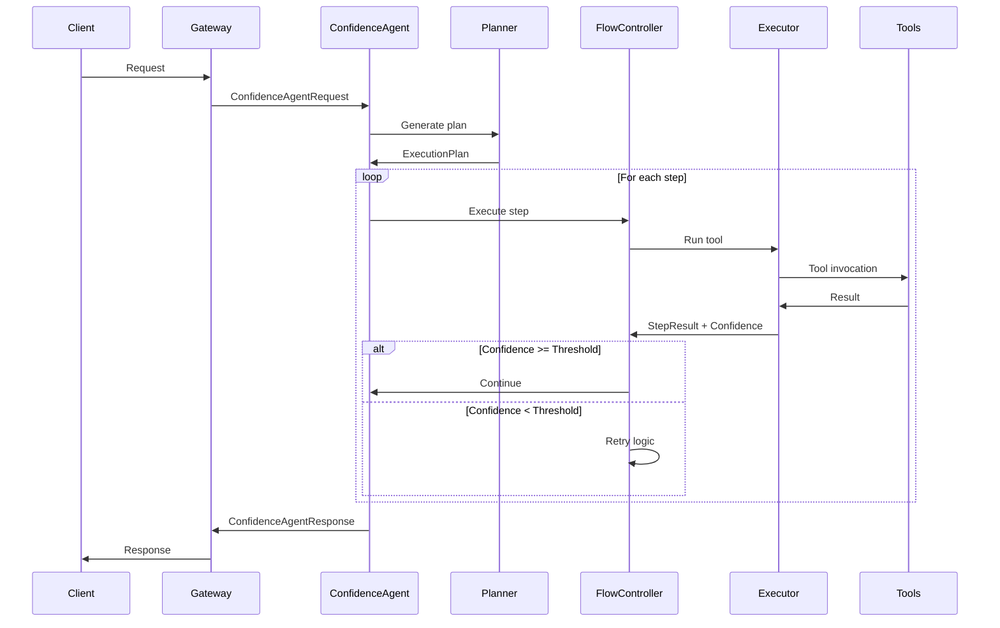

# TrustGraph Confidence-Based Agent Architecture
## Technical Specification v1.0

### Executive Summary

This document specifies a new agent architecture for TrustGraph that introduces confidence-based execution control as an alternative to the existing ReAct-based agent system. The architecture will be implemented as a new module set under `trustgraph-flow/trustgraph/agent/confidence/` to provide enhanced reliability, auditability, and reduced hallucinations for critical knowledge graph operations.

### 1. Architecture Overview

#### 1.1 Design Principles

- **Modularity**: New confidence-based agent lives alongside existing ReAct agent
- **Service-Oriented**: Follows TrustGraph's existing Pulsar-based service patterns
- **Schema-Driven**: Leverages existing schema definitions with minimal extensions
- **Tool Agnostic**: Works with existing tools (KnowledgeQuery, TextCompletion, McpTool)

#### 1.2 High-Level Architecture

```
┌─────────────────────────────────────────────────────────────────┐
│                      Gateway Service Layer                       │
│                   (dispatch/agent_confidence.py)                 │
└────────────────────────────┬────────────────────────────────────┘
                             │
                    Pulsar Message Bus
                             │
┌─────────────────────────────┴────────────────────────────────────┐
│              Confidence Agent Service                            │
│            (agent/confidence/service.py)                         │
│                                                                   │
│  ┌──────────────┐  ┌───────────────┐  ┌────────────────┐       │
│  │   Planner    │  │ Flow Controller│  │ Confidence     │       │
│  │   Module     │─▶│   Module      │─▶│  Evaluator     │       │
│  └──────────────┘  └───────────────┘  └────────────────┘       │
│         │                  │                    │                │
│         ▼                  ▼                    ▼                │
│  ┌──────────────┐  ┌───────────────┐  ┌────────────────┐       │
│  │ Execution    │  │    Memory     │  │   Audit        │       │
│  │   Engine     │◄─│    Manager    │  │   Logger       │       │
│  └──────────────┘  └───────────────┘  └────────────────┘       │
└───────────────────────────────────────────────────────────────┘
                             │
                    Tool Service Clients
                             │
     ┌───────────────┬───────┴────────┬────────────────┐
     ▼               ▼                 ▼                 ▼
KnowledgeQuery  TextCompletion    McpTool         PromptService
```

### 2. Module Specifications

#### 2.1 Core Modules Location

All new modules will be created under:
```
trustgraph-flow/trustgraph/agent/confidence/
├── __init__.py
├── __main__.py
├── service.py           # Main service entry point
├── planner.py          # Planning module
├── flow_controller.py  # Flow orchestration
├── confidence.py       # Confidence evaluation
├── memory.py          # Memory management
├── executor.py        # Step execution
├── audit.py           # Audit logging
└── types.py           # Type definitions
```

#### 2.2 Schema Extensions

New schemas in `trustgraph-base/trustgraph/schema/services/agent_confidence.py`:

```python
from pulsar.schema import Record, String, Array, Map, Float, Integer, Boolean

class ConfidenceMetrics(Record):
    score = Float()
    reasoning = String()
    retry_count = Integer()
    
class ExecutionStep(Record):
    id = String()
    function = String()
    arguments = Map(String())
    dependencies = Array(String())
    confidence_threshold = Float()
    timeout_ms = Integer()
    
class ExecutionPlan(Record):
    id = String()
    steps = Array(ExecutionStep)
    context = Map(String())
    
class StepResult(Record):
    step_id = String()
    success = Boolean()
    output = String()
    confidence = ConfidenceMetrics()
    execution_time_ms = Integer()
    
class ConfidenceAgentRequest(Record):
    question = String()
    confidence_threshold = Float()
    max_retries = Integer()
    override_enabled = Boolean()
    context = Map(String())
    
class ConfidenceAgentResponse(Record):
    answer = String()
    plan = ExecutionPlan()
    results = Array(StepResult)
    final_confidence = Float()
    audit_trail = String()
    error = Error()
```

### 3. Module Implementation Details

#### 3.1 Planner Module (`planner.py`)

```python
class PlannerModule:
    """
    Generates structured execution plans from user requests.
    Uses LLM to create confidence-scored step sequences.
    """
    
    def __init__(self, llm_client, tool_registry):
        self.llm_client = llm_client
        self.tool_registry = tool_registry
        
    async def generate_plan(
        self, 
        request: str, 
        context: dict,
        available_tools: list
    ) -> ExecutionPlan:
        """
        Generate execution plan with confidence thresholds.
        
        Returns:
            ExecutionPlan with steps, dependencies, and confidence scores
        """
        # Implementation details...
```

**Key Responsibilities:**
- Parse user requests into structured plans
- Assign confidence thresholds based on operation criticality
- Determine step dependencies
- Select appropriate tool combinations

#### 3.2 Flow Controller (`flow_controller.py`)

```python
class FlowController:
    """
    Orchestrates plan execution with confidence-based control flow.
    """
    
    def __init__(self, executor, memory_manager, confidence_evaluator):
        self.executor = executor
        self.memory = memory_manager
        self.evaluator = confidence_evaluator
        
    async def execute_plan(
        self,
        plan: ExecutionPlan,
        config: dict
    ) -> list[StepResult]:
        """
        Execute plan with confidence threshold enforcement.
        
        Implements:
        - Step dependency resolution
        - Confidence-based retry logic
        - User override handling
        - Graceful failure modes
        """
        # Implementation details...
```

**Configuration Schema:**
```yaml
confidence_agent:
  default_confidence_threshold: 0.7
  max_retries: 3
  retry_backoff_factor: 2.0
  override_enabled: true
  step_timeout_ms: 30000
  parallel_execution: false
```

#### 3.3 Confidence Evaluator (`confidence.py`)

```python
class ConfidenceEvaluator:
    """
    Evaluates confidence scores for execution results.
    """
    
    async def evaluate_result(
        self,
        function_name: str,
        input_args: dict,
        output: any,
        execution_context: dict
    ) -> ConfidenceMetrics:
        """
        Calculate confidence score for a step result.
        
        Factors:
        - Output completeness
        - Semantic consistency
        - Historical success rates
        - Function-specific rules
        """
        # Implementation details...
```

**Confidence Scoring Factors:**
- Graph query result size and consistency
- Entity extraction precision scores
- Vector search similarity thresholds
- LLM response coherence metrics

#### 3.4 Memory Manager (`memory.py`)

```python
class MemoryManager:
    """
    Manages inter-step data flow and context preservation.
    """
    
    def __init__(self, max_context_size: int = 8192):
        self.max_context_size = max_context_size
        self.step_outputs = {}
        self.global_context = {}
        
    async def store_result(
        self, 
        step_id: str, 
        result: any,
        metadata: dict
    ):
        """Store step result with intelligent pruning."""
        
    async def get_context_for_step(
        self,
        step: ExecutionStep,
        dependencies: list[str]
    ) -> dict:
        """Build context for step execution."""
```

**Memory Strategies:**
- Selective context passing based on dependencies
- Graph data serialization for efficiency
- Automatic context window management
- Result caching with TTL

#### 3.5 Executor Module (`executor.py`)

```python
class StepExecutor:
    """
    Executes individual plan steps using registered tools.
    """
    
    def __init__(self, tool_clients: dict):
        self.tool_clients = tool_clients
        
    async def execute_step(
        self,
        step: ExecutionStep,
        context: dict
    ) -> StepResult:
        """
        Execute a single step with appropriate tool.
        
        Handles:
        - Tool selection and invocation
        - Error handling and timeouts
        - Result transformation
        """
        # Implementation details...
```

**Tool Mapping:**
- `GraphQuery` → GraphRagClient
- `TextCompletion` → TextCompletionClient  
- `McpTool` → McpToolClient
- `Prompt` → PromptClient

#### 3.6 Service Implementation (`service.py`)

```python
class ConfidenceAgentService(AgentService):
    """
    Main service class for confidence-based agent.
    """
    
    def __init__(self, **params):
        super().__init__(**params)
        
        # Initialize modules
        self.planner = PlannerModule(...)
        self.flow_controller = FlowController(...)
        self.executor = StepExecutor(...)
        
        # Register client specifications
        self.register_specification(TextCompletionClientSpec(...))
        self.register_specification(GraphRagClientSpec(...))
        self.register_specification(ToolClientSpec(...))
        
    async def handle_request(
        self, 
        request: ConfidenceAgentRequest
    ) -> ConfidenceAgentResponse:
        """
        Main request handler implementing confidence-based flow.
        """
        # 1. Generate plan
        plan = await self.planner.generate_plan(...)
        
        # 2. Execute with confidence control
        results = await self.flow_controller.execute_plan(...)
        
        # 3. Generate response
        return ConfidenceAgentResponse(...)
```

### 4. Integration Points

#### 4.1 Gateway Integration

New dispatcher in `trustgraph-flow/trustgraph/gateway/dispatch/agent_confidence.py`:

```python
from ... schema import ConfidenceAgentRequest, ConfidenceAgentResponse
from . requestor import ServiceRequestor

class ConfidenceAgentRequestor(ServiceRequestor):
    def __init__(self, pulsar_client, request_queue, response_queue, ...):
        super().__init__(
            request_schema=ConfidenceAgentRequest,
            response_schema=ConfidenceAgentResponse,
            ...
        )
```

#### 4.2 Configuration Integration

Configuration in deployment YAML:

```yaml
services:
  - name: confidence-agent
    module: trustgraph.agent.confidence
    instances: 2
    config:
      max_iterations: 15
      confidence_threshold: 0.75
      
  # Existing react agent continues to work
  - name: react-agent  
    module: trustgraph.agent.react
    instances: 2
```

#### 4.3 Tool Integration

The confidence agent reuses existing tool implementations:
- `KnowledgeQueryImpl` for graph RAG operations
- `TextCompletionImpl` for LLM completions
- `McpToolImpl` for MCP tool invocations
- `PromptImpl` for prompt-based operations

No changes required to existing tools.

### 5. Execution Flow

#### 5.1 Request Processing



#### 5.2 Confidence-Based Control Flow

```python
async def execute_with_confidence(step, context, config):
    retries = 0
    while retries < config.max_retries:
        result = await executor.execute_step(step, context)
        confidence = await evaluator.evaluate_result(result)
        
        if confidence.score >= step.confidence_threshold:
            return result
            
        retries += 1
        await asyncio.sleep(config.retry_backoff_factor ** retries)
        
    # Max retries exceeded
    if config.override_enabled:
        return await request_user_override(step, result)
    else:
        raise LowConfidenceError(step, confidence)
```

### 6. Monitoring and Observability

#### 6.1 Metrics

New metrics to expose via Prometheus:

```python
# Confidence metrics
confidence_score_histogram = Histogram(
    'agent_confidence_score',
    'Confidence scores distribution',
    buckets=[0.1, 0.3, 0.5, 0.7, 0.9, 1.0]
)

# Retry metrics  
retry_count_counter = Counter(
    'agent_retry_count',
    'Number of retries by function',
    ['function_name']
)

# Plan execution metrics
plan_execution_duration = Histogram(
    'agent_plan_execution_seconds',
    'Plan execution duration'
)
```

#### 6.2 Audit Trail

Structured audit logging format:

```json
{
    "execution_id": "550e8400-e29b-41d4-a716-446655440000",
    "timestamp": "2024-01-15T10:30:00Z",
    "request": {
        "question": "Find relationships between entities X and Y",
        "confidence_threshold": 0.75
    },
    "plan": {
        "steps": [
            {
                "id": "step-1",
                "function": "GraphQuery",
                "confidence_threshold": 0.8
            }
        ]
    },
    "execution": [
        {
            "step_id": "step-1",
            "start_time": "2024-01-15T10:30:01Z",
            "end_time": "2024-01-15T10:30:02Z",
            "confidence_score": 0.85,
            "retry_count": 0,
            "success": true
        }
    ],
    "final_confidence": 0.85,
    "total_duration_ms": 1500
}
```

### 7. Testing Strategy

#### 7.1 Unit Tests

Location: `tests/unit/test_agent/test_confidence/`

```python
# test_planner.py
async def test_plan_generation():
    planner = PlannerModule(mock_llm, mock_tools)
    plan = await planner.generate_plan("Extract entities from document")
    assert len(plan.steps) > 0
    assert all(s.confidence_threshold > 0 for s in plan.steps)

# test_confidence.py  
async def test_confidence_evaluation():
    evaluator = ConfidenceEvaluator()
    metrics = await evaluator.evaluate_result(...)
    assert 0 <= metrics.score <= 1
```

#### 7.2 Integration Tests

Location: `tests/integration/test_agent_confidence/`

```python
async def test_end_to_end_confidence_flow():
    # Test complete flow with mock services
    request = ConfidenceAgentRequest(
        question="What entities are in the knowledge graph?",
        confidence_threshold=0.7
    )
    response = await agent.handle_request(request)
    assert response.final_confidence >= 0.7
```

#### 7.3 Contract Tests

Ensure compatibility with existing service contracts:

```python
async def test_pulsar_message_compatibility():
    # Verify schema serialization/deserialization
    request = ConfidenceAgentRequest(...)
    serialized = schema.encode(request)
    deserialized = schema.decode(serialized)
    assert request == deserialized
```

### 8. Migration and Rollout

#### 8.1 Phased Rollout Plan

**Phase 1: Development (Weeks 1-2)**
- Implement core modules
- Unit testing
- Local integration testing

**Phase 2: Testing (Weeks 3-4)**
- Integration with test environment
- Performance benchmarking
- A/B testing setup

**Phase 3: Canary Deployment (Week 5)**
- Deploy alongside existing agent
- Route 5% of traffic initially
- Monitor metrics and confidence scores

**Phase 4: Progressive Rollout (Weeks 6-8)**
- Gradually increase traffic percentage
- Collect feedback and tune thresholds
- Full rollout decision

#### 8.2 Feature Flags

```yaml
feature_flags:
  confidence_agent_enabled: true
  confidence_agent_traffic_percentage: 5
  confidence_agent_fallback_to_react: true
```

#### 8.3 Rollback Strategy

- Existing ReAct agent remains fully operational
- Gateway can instantly route all traffic back to ReAct agent
- No data migration required (stateless services)

### 9. Performance Considerations

#### 9.1 Expected Performance Impact

| Metric | ReAct Agent | Confidence Agent | Impact |
|--------|------------|------------------|--------|
| Latency (p50) | 500ms | 650ms | +30% due to planning |
| Latency (p99) | 2000ms | 3000ms | +50% with retries |
| Success Rate | 85% | 92% | +7% improvement |
| Memory Usage | 512MB | 768MB | +50% for context |

#### 9.2 Optimization Strategies

- **Plan Caching**: Cache plans for similar requests
- **Parallel Execution**: Execute independent steps concurrently
- **Confidence Precomputation**: Pre-calculate confidence for common operations
- **Context Pruning**: Aggressive memory management for large contexts

### 10. Security Considerations

#### 10.1 Data Protection

- Confidence scores must not leak sensitive information
- Audit trails sanitized before logging
- Memory manager respects data classification levels

#### 10.2 Access Control

- Inherit existing TrustGraph RBAC policies
- Override functionality requires elevated privileges
- Audit trail access restricted to administrators

### 11. Open Questions and Future Work

#### 11.1 Immediate Questions for Implementation

1. **LLM Selection for Planning**: Should we use a specialized fine-tuned model for plan generation, or leverage the existing text completion service?

2. **Confidence Calibration**: What specific calibration methodology should be used to ensure confidence scores are meaningful across different operation types?

3. **Parallel Execution**: Should Phase 1 include parallel step execution, or defer to Phase 2?

#### 11.2 Future Enhancements

1. **Adaptive Thresholds**: Machine learning-based threshold adjustment based on historical performance

2. **Plan Templates**: Pre-defined execution templates for common query patterns

3. **Multi-Agent Coordination**: Support for confidence-based multi-agent workflows

4. **Explainable Confidence**: Natural language explanations for confidence scores

### 12. Conclusion

This specification defines a confidence-based agent architecture that:

- **Integrates seamlessly** with existing TrustGraph infrastructure
- **Provides enhanced reliability** through confidence-based control
- **Maintains compatibility** with existing tools and services
- **Enables gradual adoption** through side-by-side deployment

The architecture is designed to be implemented incrementally, tested thoroughly, and deployed safely alongside the existing ReAct agent system.

### Appendix A: Example Configuration

Complete configuration example for deployment:

```yaml
# confidence-agent-config.yaml
service:
  name: confidence-agent
  type: trustgraph.agent.confidence
  
pulsar:
  request_queue: confidence-agent-request
  response_queue: confidence-agent-response
  
config:
  # Core settings
  max_iterations: 15
  default_confidence_threshold: 0.75
  
  # Retry settings
  retry:
    max_attempts: 3
    backoff_factor: 2.0
    max_delay_ms: 5000
    
  # Tool-specific thresholds
  tool_confidence:
    GraphQuery: 0.8
    TextCompletion: 0.7
    McpTool: 0.6
    
  # Memory management
  memory:
    max_context_size: 8192
    cache_ttl_seconds: 300
    
  # Audit settings
  audit:
    enabled: true
    log_level: INFO
    include_raw_outputs: false
    
  # Performance
  performance:
    parallel_execution: false
    plan_cache_size: 100
    timeout_ms: 30000
```

### Appendix B: API Examples

#### Request Example

```json
{
  "question": "What are the relationships between Company A and Company B in the knowledge graph?",
  "confidence_threshold": 0.8,
  "max_retries": 3,
  "override_enabled": true,
  "context": {
    "user_id": "user123",
    "session_id": "session456"
  }
}
```

#### Response Example

```json
{
  "answer": "Company A and Company B have 3 relationships: 1) Partnership agreement signed 2023, 2) Shared board member John Doe, 3) Joint venture in Project X",
  "plan": {
    "id": "plan-789",
    "steps": [
      {
        "id": "step-1",
        "function": "GraphQuery",
        "arguments": {
          "query": "MATCH (a:Company {name: 'Company A'})-[r]-(b:Company {name: 'Company B'}) RETURN r"
        },
        "confidence_threshold": 0.8
      }
    ]
  },
  "results": [
    {
      "step_id": "step-1",
      "success": true,
      "output": "[partnership, board_member, joint_venture]",
      "confidence": {
        "score": 0.92,
        "reasoning": "Query returned consistent, well-formed results",
        "retry_count": 0
      },
      "execution_time_ms": 145
    }
  ],
  "final_confidence": 0.92,
  "audit_trail": "execution-log-url"
}
```