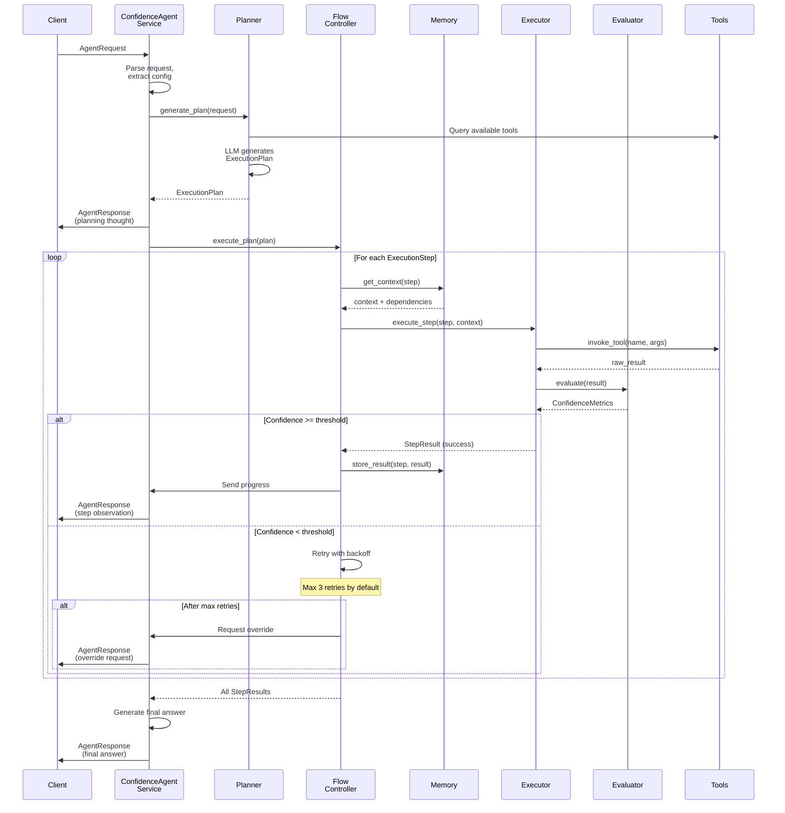

# TrustGraph Confidence-Based Agent Architecture
## Technical Specification v1.0

### Executive Summary

This document specifies a new agent architecture for TrustGraph that introduces confidence-based execution control as an alternative to the existing ReAct-based agent system. The architecture will be implemented as a new module set under `trustgraph-flow/trustgraph/agent/confidence/` to provide enhanced reliability, auditability, and reduced hallucinations for critical knowledge graph operations.

### 1. Architecture Overview

#### 1.1 Design Principles

- **Modularity**: New confidence-based agent lives alongside existing ReAct agent
- **Service-Oriented**: Follows TrustGraph's existing Pulsar-based service patterns
- **Schema-Driven**: Leverages existing schema definitions with minimal extensions
- **Tool Agnostic**: Works with existing tools (KnowledgeQuery, TextCompletion, McpTool)

#### 1.2 High-Level Architecture

```
┌──────────────────────────────────────────────────────────────────┐
│                      Gateway Service Layer                       │
│                   (dispatch/agent_confidence.py)                 │
└────────────────────────────┬─────────────────────────────────────┘
                             │
                    Pulsar Message Bus
                             │
┌─────────────────────────────┴────────────────────────────────────┐
│              Confidence Agent Service                            │
│            (agent/confidence/service.py)                         │
│                                                                  │
│  ┌──────────────┐   ┌─────────────────┐   ┌────────────────┐     │
│  │   Planner    │   │ Flow Controller │   │   Confidence   │     │
│  │   Module     │─▶│      Module     │─▶│   Evaluator    │     │
│  └──────────────┘   └─────────────────┘   └────────────────┘     │
│         │                  │                    │                │
│         ▼                  ▼                    ▼                │
│  ┌──────────────┐   ┌───────────────┐     ┌────────────────┐     │
│  │   Execution  │   │    Memory     │     │     Audit      │     │
│  │    Engine    │◄──│    Manager    │     │     Logger     │     │
│  └──────────────┘   └───────────────┘     └────────────────┘     │
└──────────────────────────────────────────────────────────────────┘
                             │
                    Tool Service Clients
                             │
     ┌───────────────┬───────┴─────────┬─────────────────┐
     ▼               ▼                 ▼                 ▼
KnowledgeQuery  TextCompletion      McpTool         PromptService
```

### 2. Module Specifications

#### 2.1 Core Modules Location

All new modules will be created under:
```
trustgraph-flow/trustgraph/agent/confidence/
├── __init__.py
├── __main__.py
├── service.py           # Main service entry point
├── planner.py          # Planning module
├── flow_controller.py  # Flow orchestration
├── confidence.py       # Confidence evaluation
├── memory.py          # Memory management
├── executor.py        # Step execution
├── audit.py           # Audit logging
└── types.py           # Type definitions
```

#### 2.2 External Interface - Drop-in Replacement

The confidence-based agent uses the existing `AgentRequest` and `AgentResponse` schemas as its external interface, making it a drop-in replacement for the ReAct agent:

**Input:** `AgentRequest` (from `trustgraph-base/trustgraph/schema/services/agent.py`)
**Output:** `AgentResponse` (from `trustgraph-base/trustgraph/schema/services/agent.py`)

This ensures complete compatibility with existing gateway dispatchers and client code.

#### 2.3 Internal Schemas

New internal schemas in `trustgraph-base/trustgraph/schema/services/agent_confidence.py`:

**ConfidenceMetrics**
- `score`: Float - Confidence score (0.0 to 1.0)
- `reasoning`: String - Explanation of score calculation
- `retry_count`: Integer - Number of retries attempted

**ExecutionStep**
- `id`: String - Unique step identifier
- `function`: String - Tool/function to execute
- `arguments`: Map(String) - Arguments for the function
- `dependencies`: Array(String) - IDs of prerequisite steps
- `confidence_threshold`: Float - Minimum acceptable confidence
- `timeout_ms`: Integer - Execution timeout

**ExecutionPlan**
- `id`: String - Plan identifier
- `steps`: Array(ExecutionStep) - Ordered execution steps
- `context`: Map(String) - Global context for plan

**StepResult**
- `step_id`: String - Reference to ExecutionStep
- `success`: Boolean - Execution success status
- `output`: String - Step execution output
- `confidence`: ConfidenceMetrics - Confidence evaluation
- `execution_time_ms`: Integer - Actual execution time

These internal schemas are used for:
- Passing structured data between confidence agent modules
- Storing execution state and metrics
- Audit logging and debugging

#### 2.4 Communication Pattern

The confidence agent sends multiple `AgentResponse` messages during execution, similar to ReAct's thought/observation pattern:

1. **Planning Phase**: Sends responses with planning thoughts and observations about the generated execution plan
2. **Execution Phase**: For each step, sends responses with:
   - `thought`: Current step being executed and confidence reasoning
   - `observation`: Tool output and confidence evaluation
3. **Final Response**: Sends the final answer with overall confidence assessment

This streaming approach provides real-time visibility into the agent's reasoning and confidence evaluations while maintaining compatibility with existing clients.

### 3. Module Implementation Details

#### 3.1 Planner Module (`planner.py`)

The Planner Module generates structured execution plans from user requests using an LLM to create confidence-scored step sequences.

**Key Responsibilities:**
- Parse user requests into structured plans
- Assign confidence thresholds based on operation criticality
- Determine step dependencies
- Select appropriate tool combinations

#### 3.2 Flow Controller (`flow_controller.py`)

The Flow Controller orchestrates plan execution with confidence-based control flow, managing step dependencies and retry logic.

**Key Capabilities:**
- Step dependency resolution
- Confidence-based retry logic  
- User override handling
- Graceful failure modes

**Configuration Schema:**
```yaml
confidence_agent:
  default_confidence_threshold: 0.7
  max_retries: 3
  retry_backoff_factor: 2.0
  override_enabled: true
  step_timeout_ms: 30000
  parallel_execution: false
```

#### 3.3 Confidence Evaluator (`confidence.py`)

The Confidence Evaluator calculates confidence scores for execution results based on multiple factors to ensure reliability.

**Confidence Scoring Factors:**
- Graph query result size and consistency
- Entity extraction precision scores
- Vector search similarity thresholds
- LLM response coherence metrics

#### 3.4 Memory Manager (`memory.py`)

The Memory Manager handles inter-step data flow and context preservation, ensuring efficient memory usage while maintaining necessary state.

**Memory Strategies:**
- Selective context passing based on dependencies
- Graph data serialization for efficiency
- Automatic context window management
- Result caching with TTL

#### 3.5 Executor Module (`executor.py`)

The Step Executor handles individual plan step execution using registered tools, managing tool selection, error handling, and result transformation.

**Tool Mapping:**
- `GraphQuery` → GraphRagClient
- `TextCompletion` → TextCompletionClient  
- `McpTool` → McpToolClient
- `Prompt` → PromptClient

#### 3.6 Service Implementation (`service.py`)

The main service class coordinates all confidence agent components and handles request/response flow through the Pulsar message bus.

**Service Workflow:**
1. Generate execution plan via Planner Module
2. Execute plan with confidence control via Flow Controller
3. Generate response with confidence metrics and audit trail

**Client Specifications:**
- TextCompletionClientSpec for LLM operations
- GraphRagClientSpec for knowledge graph queries
- ToolClientSpec for MCP tool invocations

### 4. Integration Points

#### 4.1 Gateway Integration

The confidence agent reuses the existing gateway dispatcher `trustgraph-flow/trustgraph/gateway/dispatch/agent.py` since it uses the same AgentRequest and AgentResponse schemas. No new dispatcher is needed, making it a true drop-in replacement.

#### 4.2 Configuration Integration

Configuration in deployment YAML:

```yaml
services:
  - name: confidence-agent
    module: trustgraph.agent.confidence
    instances: 2
    config:
      max_iterations: 15
      confidence_threshold: 0.75
      
  # Existing react agent continues to work
  - name: react-agent  
    module: trustgraph.agent.react
    instances: 2
```

#### 4.3 Tool Integration

The confidence agent reuses existing tool implementations:
- `KnowledgeQueryImpl` for graph RAG operations
- `TextCompletionImpl` for LLM completions
- `McpToolImpl` for MCP tool invocations
- `PromptImpl` for prompt-based operations

No changes required to existing tools.

### 5. End-to-End Execution Flow

#### 5.1 Module Interaction Overview

When an `AgentRequest` arrives, the confidence agent orchestrates the following flow:

1. **Service Entry**: The main service receives the `AgentRequest` via Pulsar
2. **Planning Phase**: Service invokes Planner Module to generate an `ExecutionPlan`
3. **Execution Loop**: Service passes plan to Flow Controller, which:
   - Resolves step dependencies
   - For each step, calls Executor with context from Memory Manager
   - Evaluator assesses confidence after each execution
   - Retry logic triggered if confidence below threshold
4. **Response Stream**: Service sends `AgentResponse` messages at key points
5. **Audit Trail**: Logger records all decisions and confidence scores

#### 5.2 Detailed Message Flow



#### 5.3 Confidence Decision Points

The confidence mechanism affects execution at three critical points:

**1. Planning Confidence**
- Planner assigns confidence thresholds to each step based on:
  - Operation criticality (graph mutations = higher threshold)
  - Tool reliability history
  - Query complexity
- Default thresholds: GraphQuery (0.8), TextCompletion (0.7), McpTool (0.6)

**2. Execution Confidence**
- After each tool execution, Evaluator calculates confidence based on:
  - Output completeness and structure
  - Consistency with expected schemas
  - Semantic coherence (for text outputs)
  - Result size and validity (for graph queries)

**3. Retry Decision**
- If confidence < threshold:
  - First retry: Same parameters with backoff
  - Second retry: Adjusted parameters (e.g., broader query)
  - Third retry: Simplified approach
  - After max retries: User override or graceful failure

#### 5.4 Example: Graph Query with Low Confidence

**Scenario**: User asks "What are the connections between Entity X and Entity Y?"

**Step 1: Planning**
```
AgentRequest arrives:
  question: "What are the connections between Entity X and Entity Y?"
  
Planner generates ExecutionPlan:
  Step 1: GraphQuery
    function: "GraphQuery"
    arguments: {"query": "MATCH path=(x:Entity {name:'X'})-[*..3]-(y:Entity {name:'Y'}) RETURN path"}
    confidence_threshold: 0.8
```

**Step 2: First Execution**
```
Executor runs GraphQuery:
  Result: Empty result set []
  
Evaluator assesses confidence:
  Score: 0.3 (low - empty results suspicious)
  Reasoning: "Empty result may indicate entities don't exist or query too restrictive"
  
Flow Controller decides:
  0.3 < 0.8 threshold → RETRY
```

**Step 3: Retry with Adjusted Query**
```
Flow Controller adjusts parameters:
  New query: "MATCH (x:Entity), (y:Entity) WHERE x.name CONTAINS 'X' AND y.name CONTAINS 'Y' RETURN x, y"
  
Executor runs adjusted query:
  Result: Found 2 entities but no connections
  
Evaluator assesses confidence:
  Score: 0.85
  Reasoning: "Entities exist but genuinely unconnected"
  
Flow Controller decides:
  0.85 >= 0.8 threshold → SUCCESS
```

**Step 4: Response Stream**
```
AgentResponse 1 (planning):
  thought: "Planning graph traversal query to find connections"
  observation: "Generated query with 3-hop path search"

AgentResponse 2 (retry):
  thought: "Initial query returned empty, adjusting search parameters"
  observation: "Retrying with broader entity matching"

AgentResponse 3 (final):
  answer: "Entity X and Entity Y exist in the graph but have no direct or indirect connections within 3 hops"
  thought: "Query successful with high confidence after parameter adjustment"
  observation: "Confidence: 0.85 - Entities verified to exist but unconnected"
```

#### 5.5 Example: Multi-Step Plan with Dependencies

**Scenario**: "Summarize the main topics discussed about AI regulation"

**ExecutionPlan Generated**:
```
Step 1: GraphQuery - Find documents about AI regulation
  confidence_threshold: 0.75
  
Step 2: TextCompletion - Extract key topics from documents
  dependencies: [Step 1]
  confidence_threshold: 0.7
  
Step 3: TextCompletion - Generate summary
  dependencies: [Step 2]
  confidence_threshold: 0.8
```

**Execution Flow**:
1. **Step 1 Success** (confidence: 0.9)
   - Found 15 relevant documents
   - Memory Manager stores document list
   
2. **Step 2 Initial Failure** (confidence: 0.5)
   - Topics extraction unclear
   - Retry with more specific prompt
   - **Retry Success** (confidence: 0.75)
   - Memory Manager stores topics list
   
3. **Step 3 Success** (confidence: 0.85)
   - Uses topics from memory
   - Generates coherent summary
   
**Total AgentResponses sent**: 6
- 1 for planning
- 2 for Step 1 (execution + success)
- 2 for Step 2 (failure + retry success)  
- 1 for Step 3
- 1 final response

### 6. Monitoring and Observability

#### 6.1 Metrics

New metrics to expose via Prometheus:

**Confidence Metrics:**
- `agent_confidence_score` - Histogram of confidence scores with buckets [0.1, 0.3, 0.5, 0.7, 0.9, 1.0]
- `agent_confidence_failures` - Counter of steps failing confidence thresholds

**Retry Metrics:**
- `agent_retry_count` - Counter of retries by function name
- `agent_retry_success_rate` - Gauge of retry success percentage

**Plan Execution Metrics:**
- `agent_plan_execution_seconds` - Histogram of total plan execution time
- `agent_step_execution_seconds` - Histogram of individual step execution time
- `agent_plan_complexity` - Histogram of number of steps per plan

#### 6.2 Audit Trail

Structured audit logging format:

```json
{
    "execution_id": "550e8400-e29b-41d4-a716-446655440000",
    "timestamp": "2024-01-15T10:30:00Z",
    "request": {
        "question": "Find relationships between entities X and Y",
        "confidence_threshold": 0.75
    },
    "plan": {
        "steps": [
            {
                "id": "step-1",
                "function": "GraphQuery",
                "confidence_threshold": 0.8
            }
        ]
    },
    "execution": [
        {
            "step_id": "step-1",
            "start_time": "2024-01-15T10:30:01Z",
            "end_time": "2024-01-15T10:30:02Z",
            "confidence_score": 0.85,
            "retry_count": 0,
            "success": true
        }
    ],
    "final_confidence": 0.85,
    "total_duration_ms": 1500
}
```

### 7. Testing Strategy

#### 7.1 Unit Tests

Location: `tests/unit/test_agent/test_confidence/`

**Test Coverage Areas:**
- Plan generation with various request types
- Confidence score calculation and validation
- Memory manager context handling
- Flow controller retry logic
- Executor tool mapping and error handling

#### 7.2 Integration Tests

Location: `tests/integration/test_agent_confidence/`

**Test Scenarios:**
- End-to-end confidence flow with mock services
- Multi-step plan execution with dependencies
- Retry behavior under various confidence scores
- User override flow simulation
- Fallback to ReAct agent on failure

#### 7.3 Contract Tests

**Contract Validation:**
- Pulsar message schema serialization/deserialization
- Compatibility with existing tool service interfaces
- Gateway dispatcher protocol compliance
- Response format consistency with ReAct agent where applicable

### 8. Migration and Rollout

#### 8.1 Phased Rollout Plan

**Phase 1: Development (Weeks 1-2)**
- Implement core modules
- Unit testing
- Local integration testing

**Phase 2: Testing (Weeks 3-4)**
- Integration with test environment
- Performance benchmarking
- A/B testing setup

**Phase 3: Canary Deployment (Week 5)**
- Deploy alongside existing agent
- Route 5% of traffic initially
- Monitor metrics and confidence scores

**Phase 4: Progressive Rollout (Weeks 6-8)**
- Gradually increase traffic percentage
- Collect feedback and tune thresholds
- Full rollout decision

#### 8.2 Feature Flags

```yaml
feature_flags:
  confidence_agent_enabled: true
  confidence_agent_traffic_percentage: 5
  confidence_agent_fallback_to_react: true
```

#### 8.3 Rollback Strategy

- Existing ReAct agent remains fully operational
- Gateway can instantly route all traffic back to ReAct agent
- No data migration required (stateless services)

### 9. Performance Considerations

#### 9.1 Expected Performance Impact

| Metric | ReAct Agent | Confidence Agent | Impact |
|--------|------------|------------------|--------|
| Latency (p50) | 500ms | 650ms | +30% due to planning |
| Latency (p99) | 2000ms | 3000ms | +50% with retries |
| Success Rate | 85% | 92% | +7% improvement |
| Memory Usage | 512MB | 768MB | +50% for context |

#### 9.2 Optimization Strategies

- **Plan Caching**: Cache plans for similar requests
- **Parallel Execution**: Execute independent steps concurrently
- **Confidence Precomputation**: Pre-calculate confidence for common operations
- **Context Pruning**: Aggressive memory management for large contexts

### 10. Security Considerations

#### 10.1 Data Protection

- Confidence scores must not leak sensitive information
- Audit trails sanitized before logging
- Memory manager respects data classification levels

#### 10.2 Access Control

- Inherit existing TrustGraph RBAC policies
- Override functionality requires elevated privileges
- Audit trail access restricted to administrators

### 11. Open Questions and Future Work

#### 11.1 Immediate Questions for Implementation

1. **LLM Selection for Planning**: Should we use a specialized fine-tuned model for plan generation, or leverage the existing text completion service?

2. **Confidence Calibration**: What specific calibration methodology should be used to ensure confidence scores are meaningful across different operation types?

3. **Parallel Execution**: Should Phase 1 include parallel step execution, or defer to Phase 2?

#### 11.2 Future Enhancements

1. **Adaptive Thresholds**: Machine learning-based threshold adjustment based on historical performance

2. **Plan Templates**: Pre-defined execution templates for common query patterns

3. **Multi-Agent Coordination**: Support for confidence-based multi-agent workflows

4. **Explainable Confidence**: Natural language explanations for confidence scores

### 12. Conclusion

This specification defines a confidence-based agent architecture that:

- **Integrates seamlessly** with existing TrustGraph infrastructure
- **Provides enhanced reliability** through confidence-based control
- **Maintains compatibility** with existing tools and services
- **Enables gradual adoption** through side-by-side deployment

The architecture is designed to be implemented incrementally, tested thoroughly, and deployed safely alongside the existing ReAct agent system.

### Appendix A: Example Configuration

Complete configuration example for deployment:

```yaml
# confidence-agent-config.yaml
service:
  name: confidence-agent
  type: trustgraph.agent.confidence
  
pulsar:
  request_queue: confidence-agent-request
  response_queue: confidence-agent-response
  
config:
  # Core settings
  max_iterations: 15
  default_confidence_threshold: 0.75
  
  # Retry settings
  retry:
    max_attempts: 3
    backoff_factor: 2.0
    max_delay_ms: 5000
    
  # Tool-specific thresholds
  tool_confidence:
    GraphQuery: 0.8
    TextCompletion: 0.7
    McpTool: 0.6
    
  # Memory management
  memory:
    max_context_size: 8192
    cache_ttl_seconds: 300
    
  # Audit settings
  audit:
    enabled: true
    log_level: INFO
    include_raw_outputs: false
    
  # Performance
  performance:
    parallel_execution: false
    plan_cache_size: 100
    timeout_ms: 30000
```

### Appendix B: API Examples

#### Request Example (AgentRequest)

```json
{
  "question": "What are the relationships between Company A and Company B in the knowledge graph?",
  "plan": "{\"confidence_threshold\": 0.8, \"max_retries\": 3}",
  "state": "initial",
  "history": []
}
```

#### Interim Response Example (AgentResponse - Planning)

```json
{
  "answer": "",
  "thought": "Creating execution plan with confidence thresholds for graph query",
  "observation": "Plan generated: 1 step with GraphQuery function, confidence threshold 0.8",
  "error": null
}
```

#### Interim Response Example (AgentResponse - Execution)

```json
{
  "answer": "",
  "thought": "Executing GraphQuery to find relationships between Company A and Company B",
  "observation": "Query returned 3 relationships with confidence score 0.92",
  "error": null
}
```

#### Final Response Example (AgentResponse)

```json
{
  "answer": "Company A and Company B have 3 relationships: 1) Partnership agreement signed 2023, 2) Shared board member John Doe, 3) Joint venture in Project X",
  "thought": "Analysis complete with high confidence (0.92)",
  "observation": "All steps executed successfully. Audit trail available at: execution-log-789",
  "error": null
}
```
